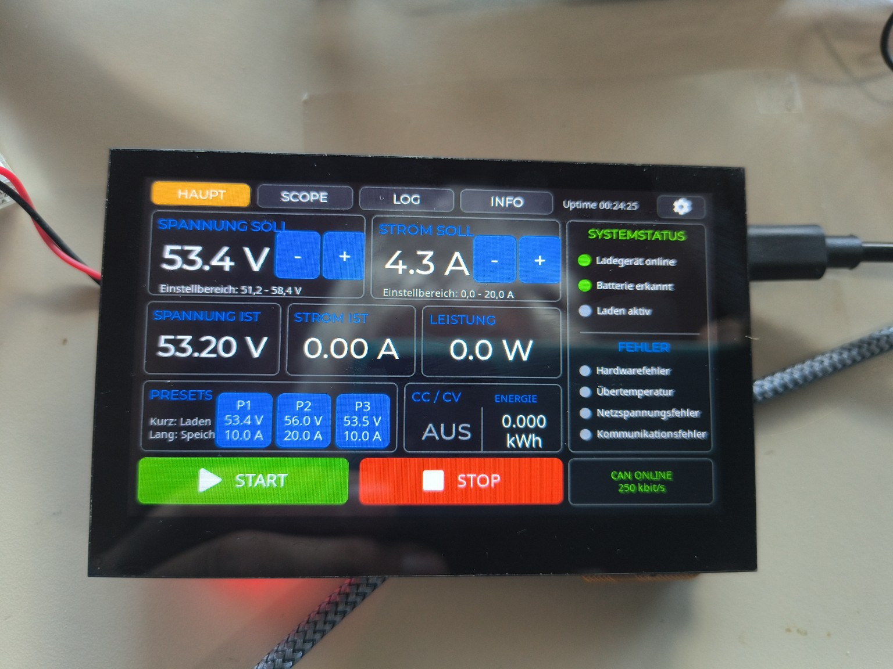
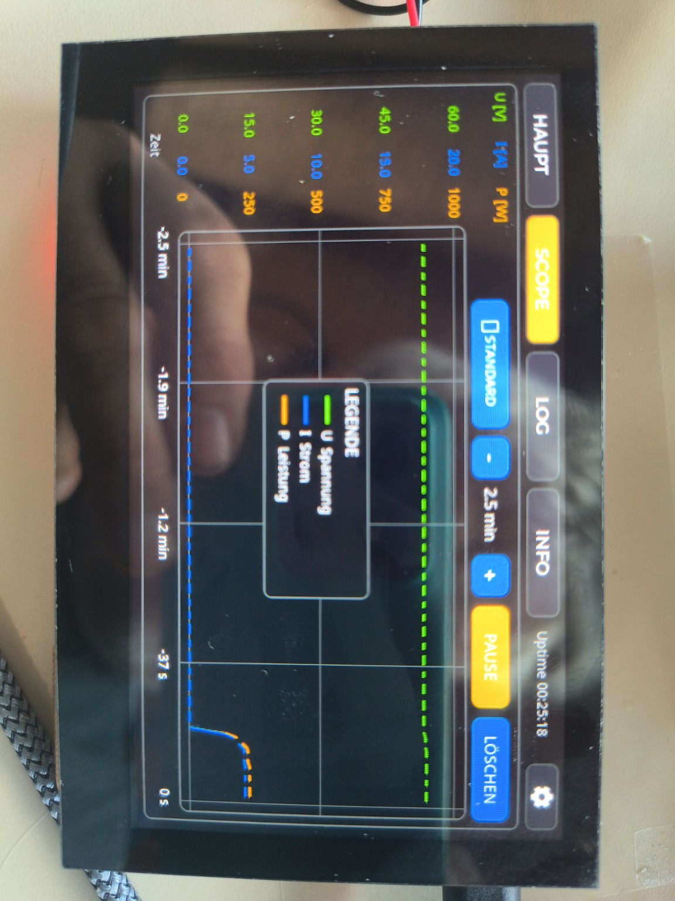
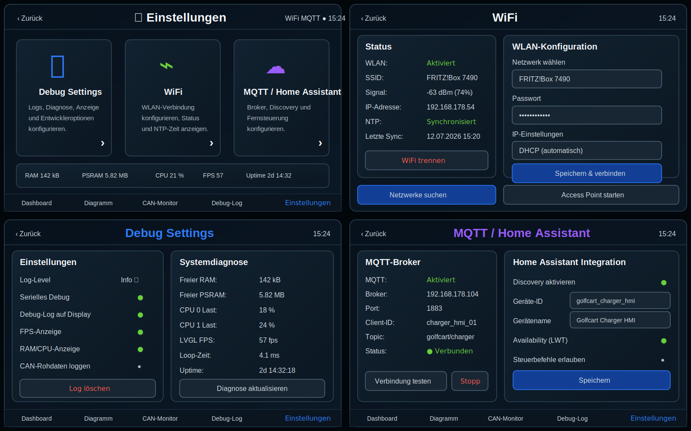
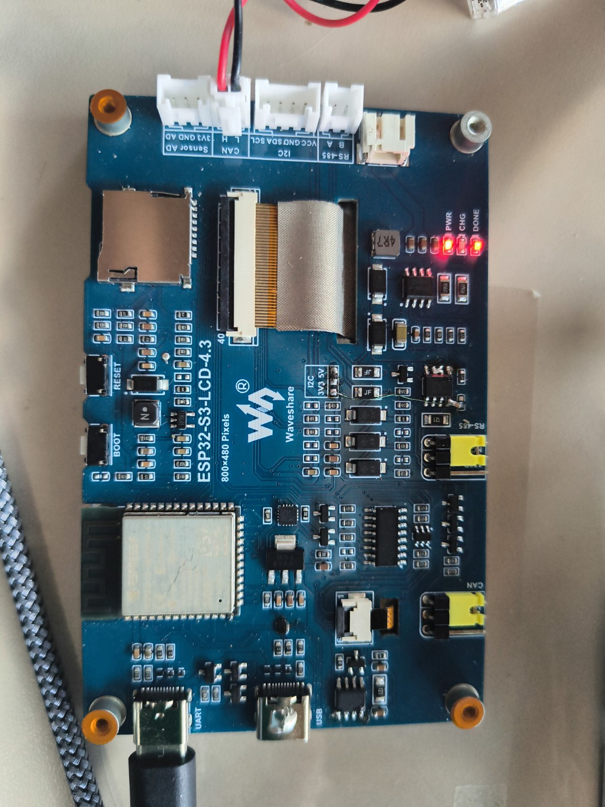
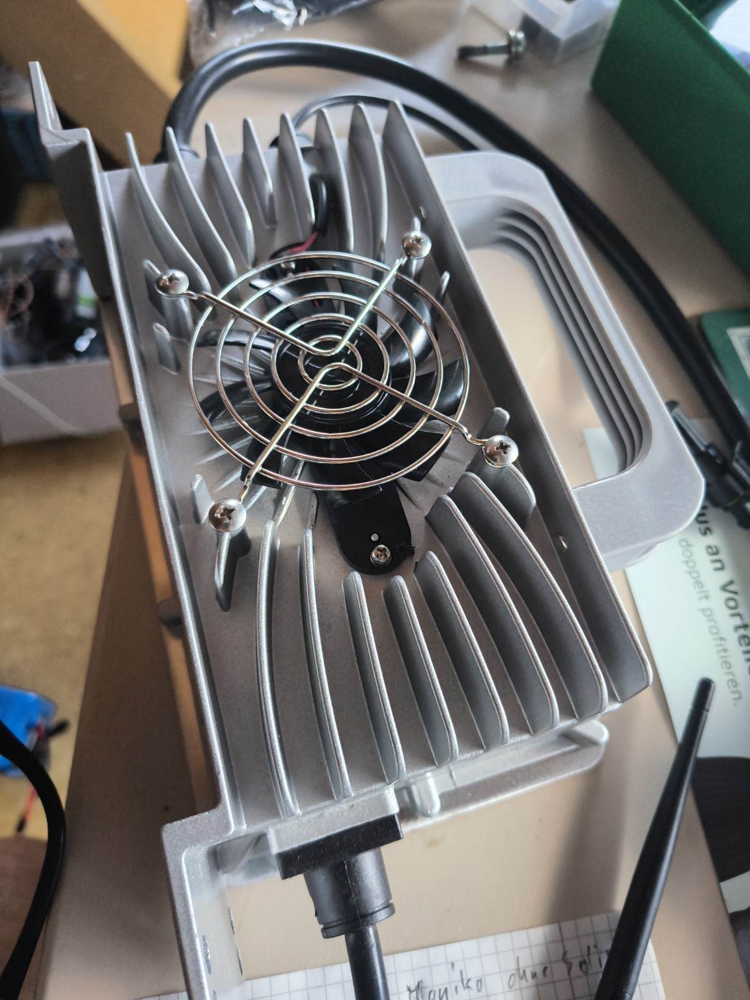
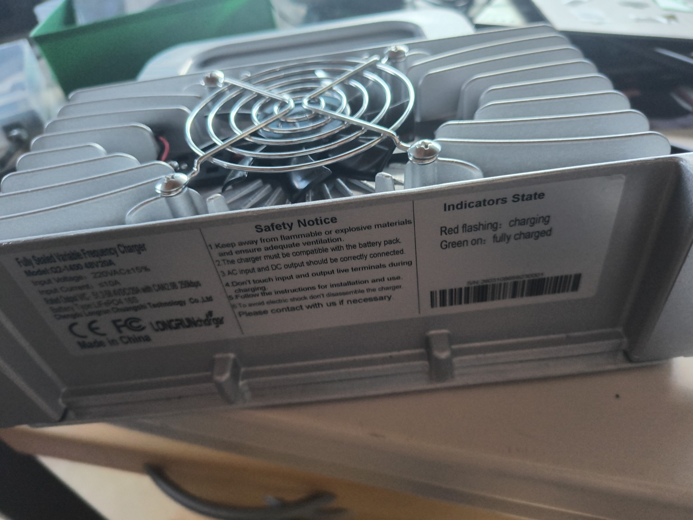

<div align="center">

# Waveshare CAN-Netzteil-HMI

### Touch-HMI für ein CAN-gesteuertes Ladegerät auf Basis des Waveshare ESP32-S3-LCD-4.3

**Aktueller Entwicklungsstand:** `V9.5.0-dev`  
**Stabile Version auf `main`:** `V9.4.2`

</div>

---

## Projektübersicht

Dieses PlatformIO-Projekt macht das Waveshare ESP32-S3-Touch-LCD-4.3 zu einer eigenständigen Bedien- und Diagnoseeinheit für ein CAN-gesteuertes Netzteil beziehungsweise Ladegerät.

Das Gerät übernimmt:

- Anzeige von Spannung, Strom, Leistung, Energie und Betriebszustand
- Vorgabe von Sollspannung und Sollstrom
- START/STOP-Steuerung
- Überwachung der CAN-Kommunikation
- grafische Aufzeichnung der Messwerte
- Fehler- und Debug-Anzeige
- ab V9.5 zusätzlich WiFi, MQTT, Home Assistant und lokalen Webzugriff

> Die Ladegeräte- und CAN-Funktion bleibt auch bei Ausfall von WLAN, MQTT, NTP oder Webserver vollständig lauffähig.

---

## Bedienoberfläche

<table>
<tr>
<td width="50%" valign="top">

### Hauptansicht



Die Hauptansicht zeigt die wichtigsten Ist- und Sollwerte. Spannung und Strom können direkt eingestellt werden. START, STOP, Presets, CC/CV-Zustand und Energiezähler sind ohne Untermenü erreichbar.

</td>
<td width="50%" valign="top">

### Scope und Trendanzeige



Die Scope-Seite zeichnet Spannung, Strom und Leistung als zeitlichen Verlauf auf. Die X- und Y-Achsen lassen sich direkt mit einem Finger skalieren. Eine verschiebbare Legende ordnet die Messkurven eindeutig zu.

</td>
</tr>
</table>

---

## Neues Einstellungsmenü für V9.5



Das neue Einstellungsmenü wird in drei klar getrennte Bereiche aufgeteilt:

| Bereich | Funktion |
|---|---|
| **Debug Settings** | Log-Level, Diagnoseanzeigen, FPS, RAM, PSRAM, CPU-Last und CAN-Rohdaten |
| **WiFi** | Netzwerksuche, SSID, Passwort, IP-Adresse, Signalstärke, NTP und Access-Point-Fallback |
| **MQTT / Home Assistant** | Broker, Topic-Präfix, Discovery, Availability/LWT und optionale Fernsteuerung |

Die lokale Touchbedienung hat immer Vorrang vor Web- und MQTT-Befehlen.

---

## Geplante Erweiterungen in V9.5

### Systemdiagnose

- freier interner RAM
- freier und gesamter PSRAM
- CPU-Auslastung
- LVGL-FPS
- Loop-Zeit
- Uptime und Reset-Grund

### Leistungsfähiger Diagrammpuffer

- größerer Ringpuffer im PSRAM
- relative Laufzeit bleibt immer verfügbar
- absolute UTC-Zeitstempel nach NTP-Synchronisation
- umschaltbare X-Achse: Laufzeit oder Uhrzeit
- Min-/Max-Verdichtung für lange Zeitbereiche
- keine SD-Karte für den Live-Puffer erforderlich

### WiFi, MQTT und Webserver

- nicht blockierende WLAN-Verbindung
- automatischer Wiederverbindungsversuch
- Access-Point-Fallback zur Ersteinrichtung
- MQTT-Telemetrie und Home-Assistant-Discovery
- lokaler Webserver mit Dashboard, Diagrammen und Konfiguration
- Administratorpasswort für START, STOP, Sollwerte und Einstellungen
- Webzugriff nur aus dem lokalen Netzwerk

---

## Hardware

<table>
<tr>
<td width="50%" valign="top">

### Waveshare ESP32-S3-LCD-4.3



Das Board kombiniert ESP32-S3, 800×480-RGB-Display, Touchcontroller und PSRAM. Der CAN-Betrieb erfolgt über den auf dem Board vorhandenen USB/CAN-Multiplexer.

</td>
<td width="50%" valign="top">

### CAN-Netzteil



Das HMI sendet die Sollwerte zyklisch über CAN und verarbeitet die Status- und Istwerttelegramme des Netzteils. Kommunikationsausfälle werden erkannt und sicher behandelt.

</td>
</tr>
</table>

<details>
<summary><strong>Typenschild des Netzteils anzeigen</strong></summary>

<br>


</details>

---

## CAN-Kommunikation

| Funktion | CAN-ID | Verhalten |
|---|---:|---|
| Sollwert- und Steuertelegramm | `0x1806E5F4` | wird im 1-s-Zyklus gesendet |
| Status- und Istwerttelegramm | `0x18FF50E5` | liefert Spannung, Strom und Status |
| Bitrate | `250 kbit/s` | Extended CAN |

Die Firmware startet immer im sicheren STOP-Zustand. Das zyklische Steuertelegramm wird trotzdem als Heartbeat weitergesendet.

---

## Navigation

Aktuelle stabile Navigation:

```text
HAUPT | SCOPE | LOG | INFO | ⚙
```

- **HAUPT:** Sollwerte, Istwerte und START/STOP
- **SCOPE:** zeitlicher Verlauf von Spannung, Strom und Leistung
- **LOG:** Debug-Ausgaben
- **INFO:** Systemstatus und CAN-Monitor
- **⚙:** Geräte- und Diagnoseeinstellungen

---

## Projektstruktur

```text
include/           zentrale Header und Konfiguration
src/               Firmware, CAN, Display, Touch und UI
docs/              Schaltpläne, Protokolle und Entwicklungsdokumentation
docs/images/       Screenshots, Hardwarebilder und Mockups
platformio.ini     reproduzierbare PlatformIO-Konfiguration
```

---

## Entwicklungsstand V9.5

Die Arbeiten erfolgen im Branch:

```text
feature/v9.5
```

Der zugehörige Pull Request bleibt bis zur vollständigen Implementierung und Hardwareprüfung als Entwurf geöffnet.

### Dokumentation

- [Entwicklungsplan V9.5](docs/V9.5_PLAN.md)
- [UI-Spezifikation Einstellungen](docs/V9.5_UI_SPEC.md)
- [Changelog](CHANGELOG.md)
- [Toolchain](docs/Toolchain.md)
- [Hardwarefehler und Korrekturen](docs/Board_Bugs_and_Fixes.md)

---

## Toolchain

- PlatformIO
- Arduino Framework
- PioArduino `55.03.39`
- LVGL `9.5.0`
- ESP32-S3 mit 16 MB Flash und OPI-PSRAM

Die verwendete Plattformversion ist festgeschrieben, damit das Projekt reproduzierbar gebaut werden kann.

---

## Debug-Schnittstelle

```text
TX: GPIO43
RX: GPIO44
Baudrate: 115200
Pegel: 3,3 V
```

Bei aktiviertem CAN wird die native USB-Datenverbindung über den FSUSB42 getrennt. Für Laufzeitdiagnose und Bootmeldungen ist deshalb der separate Debug-UART vorgesehen.

---

## Kritischer Hardwarehinweis

U7 (`SP3485EN`) ist auf dem Originalboard mit 5 V versorgt und kann dadurch einen zu hohen RO-Ausgangspegel zum ESP32 liefern. Der bestätigte Umbau auf 3,3 V ist in [`docs/Board_Bugs_and_Fixes.md`](docs/Board_Bugs_and_Fixes.md) dokumentiert.
