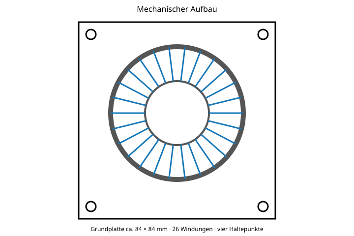

# 5 Mechanischer Aufbau und Befestigung

Der Kernstapel wird liegend auf einer elektrisch isolierenden Grundplatte montiert. Vorgesehen sind eine vollflächige beziehungsweise segmentierte Verklebung des Kernstapels und vier zusätzliche, nicht stromführende mechanische Befestigungspunkte. Die Grundplatte muss mindestens UL94 V-0 erfüllen. Zwischen Kernbeschichtung und Litze ist bei Bedarf eine zusätzliche abriebfeste Isolierlage vorzusehen.

*Abbildung 1: Vorgesehener mechanischer Aufbau der Drossel auf einer isolierenden Grundplatte.*

| Parameter | Wert |
|---|---|
| Empfohlene Grundplattenabmessung | ca. 84 × 84 mm, projektspezifisch anzupassen |
| Grundplattenmaterial | FR-4 oder gleichwertig, UL94 V-0 |
| Grundplattenstärke | 1,5 bis 2,0 mm |
| Mechanische Haltepunkte | 4 Durchsteckpunkte außerhalb des Kernaußendurchmessers |
| Kernbefestigung | hochtemperaturbeständiger, elektrisch isolierender Klebstoff |
| Mindestbauhöhe ohne Anschlussüberstand | ca. 86 bis 92 mm |

Die elektrischen Leistungsanschlüsse sind separat zugzuentlasten und dürfen nicht als mechanische Halterung dienen.
