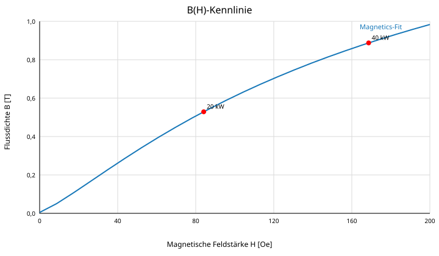
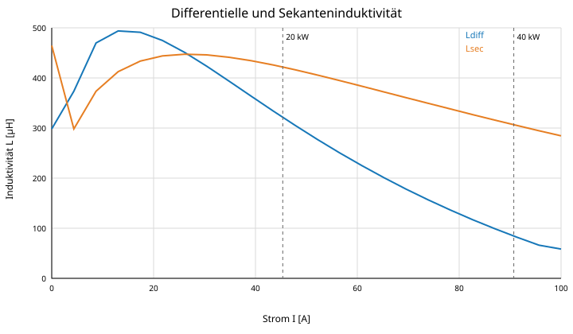
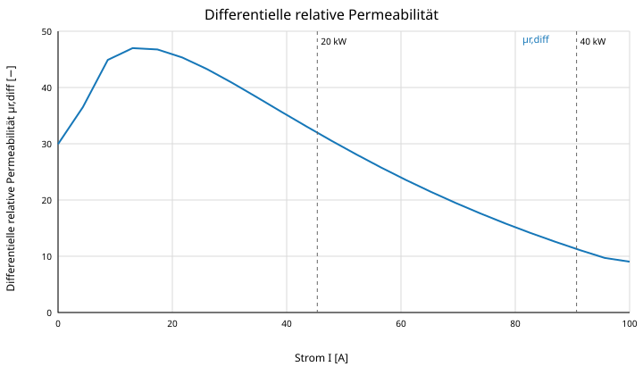

# 7 Magnetische Kennlinien

Die magnetischen Arbeitspunkte sind:

- 20 kW bei $I_{pk}=40{,}82\,\text{A}$
- 40 kW für 0,5 s bei $I_{pk}=81{,}65\,\text{A}$

Für Kupfer- und Gesamtverluste werden die zugehörigen Effektivströme 28,87 A und 57,74 A verwendet.

## 7.1 B(H)-Kennlinie

*Abbildung 3: B(H)-Kennlinie mit den magnetischen Arbeitspunkten bei 20 kW und 40 kW.*

## 7.2 Induktivitätskennlinien

*Abbildung 4: Differentielle und Sekanteninduktivität mit den magnetischen Arbeitspunkten.*

## 7.3 Differentielle Permeabilität

*Abbildung 5: Differentielle relative Permeabilität mit den magnetischen Arbeitspunkten.*

## Kennwerte aus der Herstellerfitfunktion

| Strom | Feldstärke | Flussdichte | $L_{diff}$ | $L_{sec}$ |
|---:|---:|---:|---:|---:|
| 0,0 A | 0,0 Oe | 0,005 T | 203 µH | 382 µH |
| 28,9 A | 65,2 Oe | 0,386 T | 357 µH | 372 µH |
| 40,8 A | 92,5 Oe | 0,529 T | 311 µH | 361 µH |
| 57,7 A | 131,0 Oe | 0,699 T | 253 µH | 337 µH |
| 81,6 A | 185,5 Oe | 0,888 T | 192 µH | 303 µH |
| 90,0 A | 204,2 Oe | 0,941 T | 175 µH | 292 µH |

> Die Fitkurve liefert bei sehr kleinen Feldstärken einen kleinen Offset und eine lokale Anfangssteigung, die nicht exakt der nominellen Permeabilität 60 entspricht. Für die reale Bauteilfreigabe sind deshalb Messwerte von $L(I)$ maßgebend.
