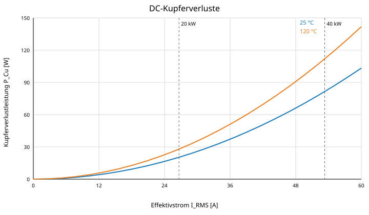

# 9 Elektrische Wicklungsverluste

## 9.1 DC-Wicklungswiderstand

Für die dokumentierte Wicklung aus 680 × 0,10-mm-HF-Litze wird der Gleichstromwiderstand bei 25 °C mit

$$
R_{DC,25}=27{,}71\,\mathrm{m\Omega}
$$

angesetzt. Die Temperaturabhängigkeit des Kupferwiderstands wird mit

$$
\alpha_{Cu}=0{,}00393\,\mathrm{K^{-1}}
$$

berechnet:

$$
R(T)=R_{25}\left[1+\alpha_{Cu}(T-25\,^{\circ}\mathrm C)\right].
$$

Für 120 °C ergibt sich:

$$
R_{DC,120}=27{,}71\,\mathrm{m\Omega}\cdot\left[1+0{,}00393\cdot(120-25)\right]
=38{,}06\,\mathrm{m\Omega}.
$$

| Wicklungstemperatur | DC-Widerstand | Bezug |
|---:|---:|---|
| 25 °C | 27,71 mΩ | gesamte Wicklung einschließlich Anschlusszuschlag |
| 120 °C | 38,06 mΩ | gesamte Wicklung einschließlich Anschlusszuschlag |

## 9.2 DC-Kupferverluste

$$P_{Cu}=I_{RMS}^2\,R(T)$$

| Arbeitspunkt | Strom | $P_{Cu}$ bei 25 °C | $P_{Cu}$ bei 120 °C |
|---|---:|---:|---:|
| 20 kW Dauerbetrieb | 28,87 A RMS | 23,1 W | 31,7 W |
| 40 kW / 0,5 s | 57,74 A RMS | 92,4 W | 126,8 W |

| Parameter | Wert |
|---|---:|
| $R_{DC}$ bei 25 °C | 27,71 mΩ |
| $R_{DC}$ bei 120 °C | 38,06 mΩ |
| $P_{Cu}$ bei 20 kW / 25 °C | 23,1 W |
| $P_{Cu}$ bei 20 kW / 120 °C | 31,7 W |
| $P_{Cu}$ bei 40 kW / 25 °C | 92,4 W |
| $P_{Cu}$ bei 40 kW / 120 °C | 126,8 W |
| Energie bei 40 kW, 0,5 s / 120 °C | 63,4 J |

*Abbildung 6: DC-Kupferverlustkennlinien bei 25 °C und 120 °C einschließlich beider Arbeitspunkte.*

HF-Zusatzverluste durch Skin- und Proximity-Effekt sind in diesen DC-Werten nicht enthalten.
