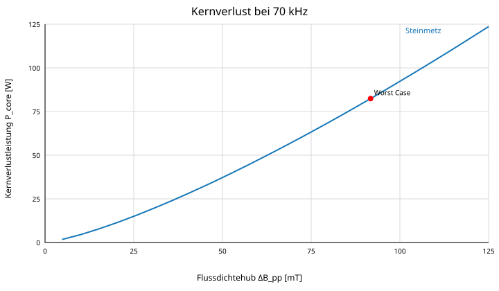
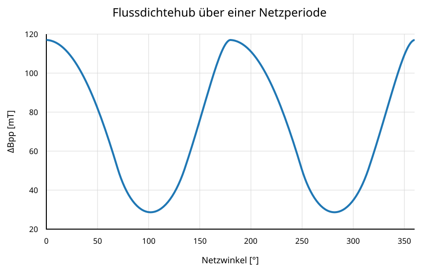
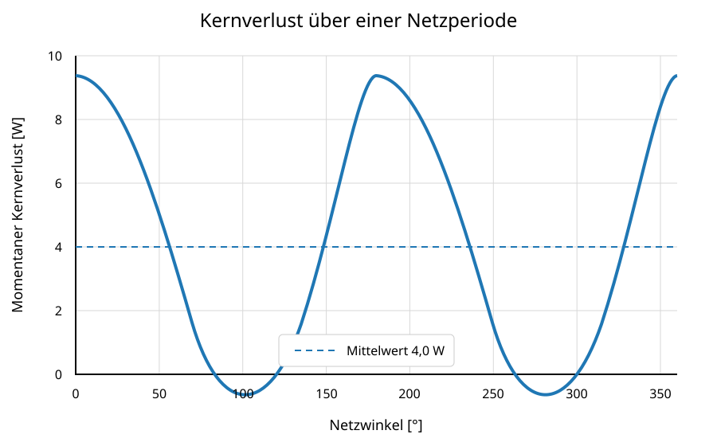

# 10 Kernverluste

Verwendete Steinmetzgleichung gemäß der zugrunde liegenden Formelsammlung:

$$P_v=a\,f^b\,(\Delta B)^c$$

$$P_{core}=P_v\,V_e$$

Für High Flux 60 µ werden folgende Koeffizienten verwendet:

| Parameter | Wert |
|---|---:|
| Steinmetz $a$ | 246,54 |
| Steinmetz $b$ | 2,218 |
| Steinmetz $c$ | 1,311 |
| Frequenz $f$ | 0,070 MHz |
| Worst-Case $\Delta B$ | 0,954 kG |
| Kernvolumen $V_e$ | 155,5 cm³ |
| Berechneter Worst-Case-Kernverlust | 98,9 W |

Für die numerische Darstellung wird als Arbeitskonvention $f$ in MHz, $\Delta B$ in kG und $P_v$ in W/cm³ angesetzt.

## 10.1 Kernverlust über dem Flussdichtehub

*Abbildung 7: Kernverlust über dem Flussdichtehub bei 70 kHz mit dem verwendeten Voltsekunden-Arbeitspunkt.*

## 10.2 Ergänzende Diagramme aus Entwicklungsspezifikation Revision 4.3

Die folgenden beiden Diagramme wurden aus der Entwicklungsspezifikation Revision 4.3 übernommen. Sie zeigen den Verlauf des hochfrequenten Flussdichtehubs und des daraus berechneten momentanen Kernverlusts über einer Netzperiode.

> **Hinweis zur Zuordnung:** Die Diagramme stammen aus der Variante mit 3 × Magnetics 0058111A2, 48 Windungen und $A_e=432\,\mathrm{mm^2}$. Sie dienen hier als ergänzende Darstellung der Berechnungsmethodik und sind nicht unmittelbar die Kennlinien des 3 × 64-mm-/26-Windungs-Beispiels.

### Flussdichtehub über einer Netzperiode

*Diagramm 4 aus Revision 4.3: Der berechnete Bereich beträgt $\Delta B_{pp}=31{,}2$ bis $129{,}2\,\mathrm{mT}$.*

### Kernverlust über einer Netzperiode

*Diagramm 5 aus Revision 4.3: Der über die Netzperiode gemittelte Kernverlust beträgt 4,0 W; der maximale momentane Rechenwert beträgt 9,2 W.*

> Die Einheitensetzung ist vor Serienfreigabe anhand der exakten Magnetics-Katalogseite zu bestätigen. Für die endgültige Verlustbewertung ist außerdem der reale Flussdichteverlauf aus der PLECS-Simulation über eine Netzperiode zu verwenden.