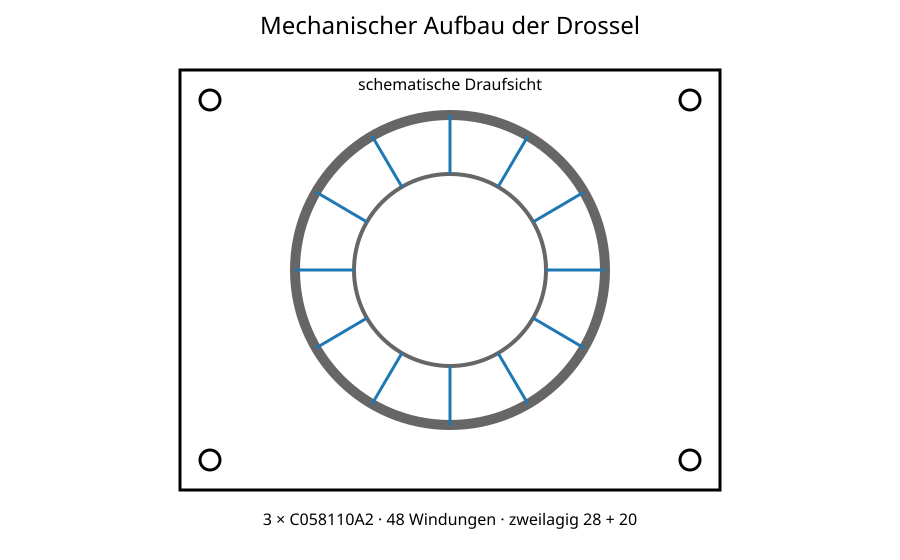

# 5 Mechanischer Aufbau

Der dreifache Kernstapel ist mechanisch fluchtend zu montieren und mit elektrisch isolierendem, hochtemperaturbeständigem Klebstoff zu verbinden. Die Kernbeschichtung darf durch die zweilagige Wicklung nicht beschädigt werden.

*Abbildung 1: Schematischer mechanischer Aufbau mit drei gestapelten Magnetics-C058110A2-Kernen und vier zusätzlichen Befestigungspunkten.*

Die Leistungsanschlüsse sind mechanisch separat zu entlasten. Die Drosselbefestigung darf nicht über die elektrischen Anschlüsse erfolgen.