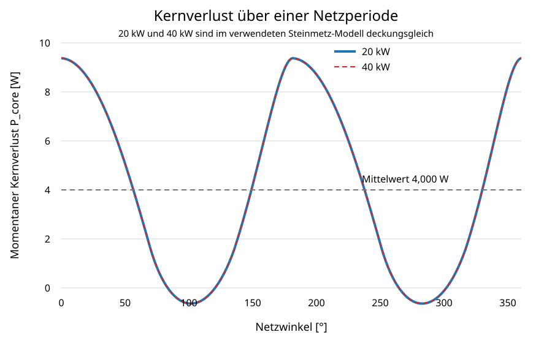

# 10 Kernverluste

Für High Flux 60 µ wird die korrigierte Steinmetz-Konvention aus der Formelsammlung verwendet:

$$P_v[\mathrm{mW/cm^3}]=246{,}54\cdot B[\mathrm{T}]^{2{,}218}\cdot f[\mathrm{kHz}]^{1{,}311}$$

$$P_{core}=P_v\,V_e.$$

Für die Berechnung wird entsprechend der bisherigen Konvention

$$B(\varphi)=B_{pk}(\varphi)=\frac{\Delta B_{pp}(\varphi)}{2}$$

verwendet. Aus Kapitel 8 gilt für beide Betriebspunkte identisch:

$$B_{pk}(\varphi)=
\frac{U_{DC}\,d(\varphi)\,[1-d(\varphi)]}
{2N A_e f_s}.$$

Die aus den beiden verbesserten $L_{diff}$-basierten Stromwelligkeitskurven zurückgerechneten Flussdichtehübe sind deckungsgleich. Daher sind auch die Kernverlustkurven für 20 kW und 40 kW im verwendeten Steinmetz-Modell identisch.

| Parameter | Wert |
|---|---:|
| $a$ | 246,54 |
| $b$ | 2,218 |
| $c$ | 1,311 |
| Kernvolumen $V_e$ | 61,78 cm³ |
| $B_{pk,min}$ | 15,597 mT |
| $B_{pk,max}$ | 64,587 mT |
| minimaler momentaner Kernverlust | 0,392 W |
| mittlerer Kernverlust über die Netzperiode | 4,000 W |
| maximaler momentaner Kernverlust | 9,174 W |

| Betriebspunkt | mittlerer Kernverlust | maximaler momentaner Kernverlust |
|---|---:|---:|
| 20 kW | 4,000 W | 9,174 W |
| 40 kW | 4,000 W | 9,174 W |

*Abbildung 9: Momentaner Kernverlust über einer Netzperiode. Die Kurven für 20 kW und 40 kW sind im verwendeten Modell deckungsgleich; der Mittelwert beträgt 4,000 W.*

Die Neuberechnung bestätigt damit die bisherigen gerundeten Werte von 4,0 W im Mittel und 9,2 W als maximalem momentanen Rechenwert. Geändert wurde die Herleitung: Die Werte sind nun explizit aus beiden verbesserten $\Delta I_{pp}$-Kurven über $L_{diff}\Delta I_{pp}/(N A_e)$ zurückgeführt.

Das verwendete Steinmetz-Modell bildet eine mögliche zusätzliche Abhängigkeit der Verlustparameter von der DC-Vormagnetisierung nicht ab. Für die nichtsinusförmige PWM-Anregung und die hohen Grundwellen-Arbeitspunkte ist daher eine Verifikation mit iGSE, Herstellerkennfeldern oder dem realen PLECS-Flussdichteverlauf erforderlich.