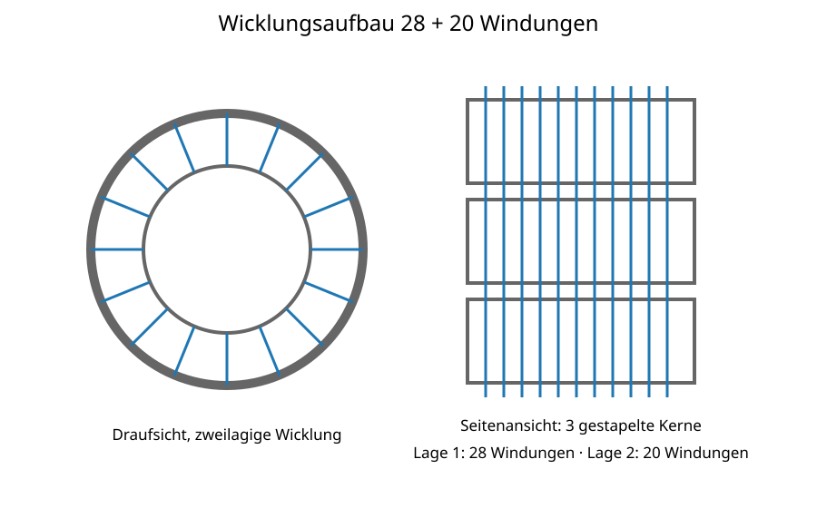
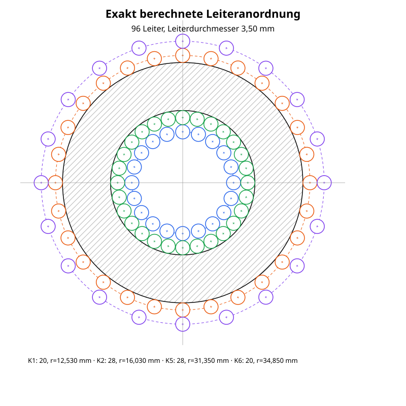
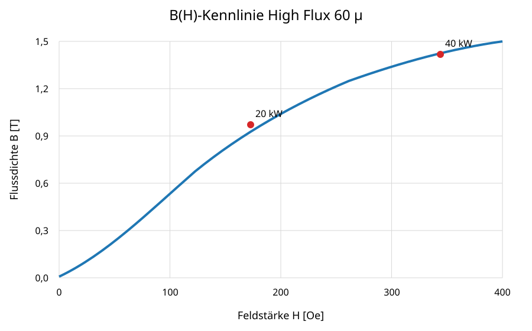
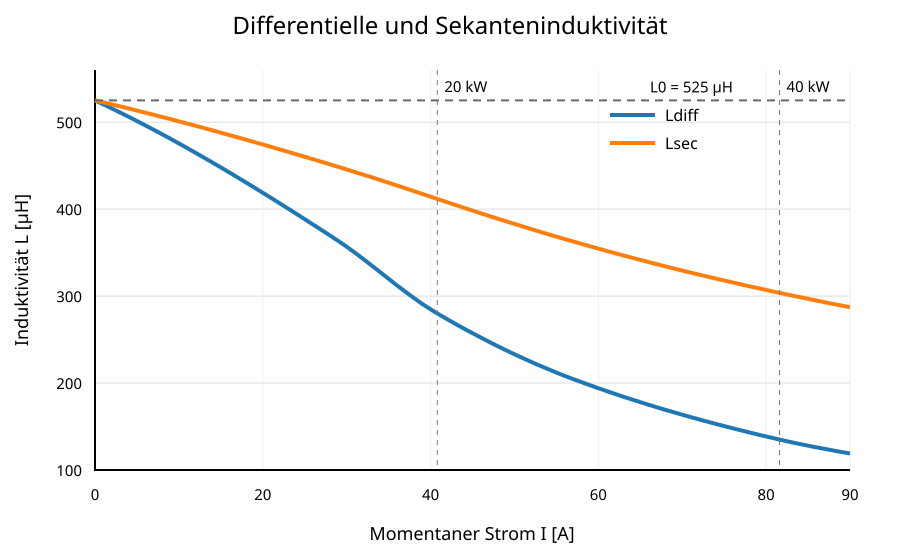
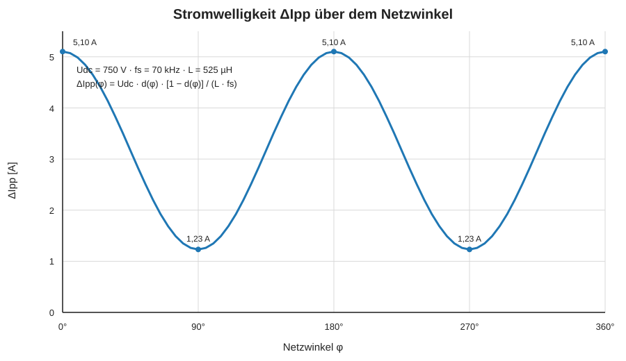
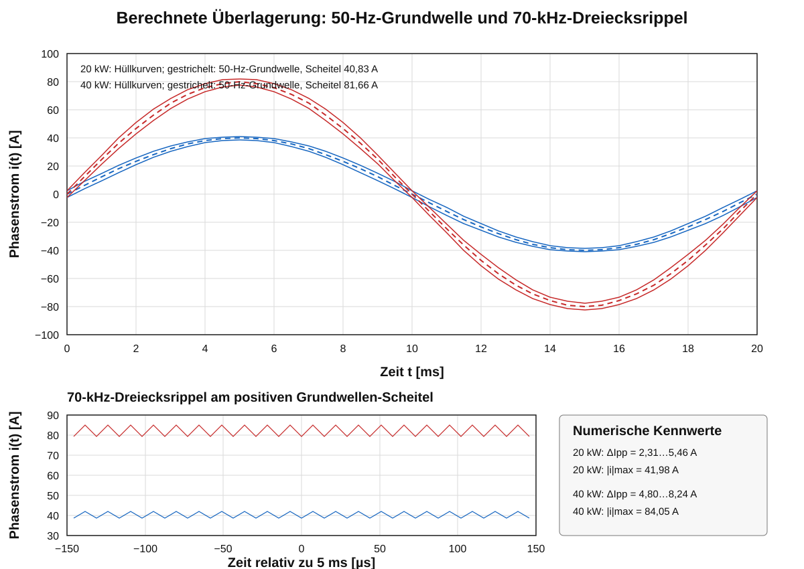
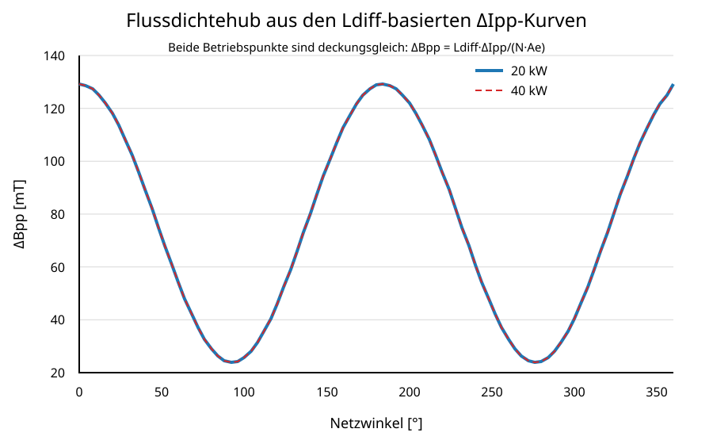
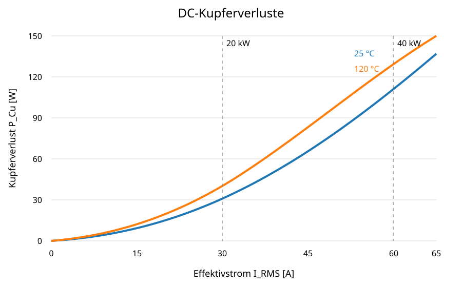
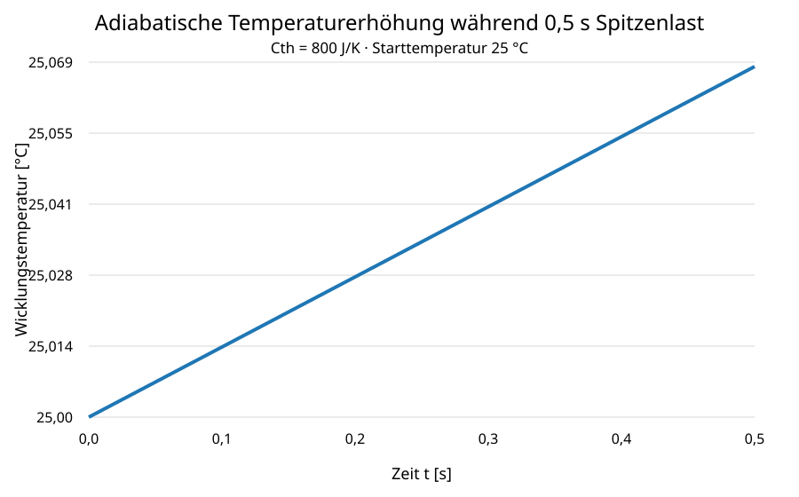

# PFC-Drossel 525 µH – 3 × Magnetics C058110A2

**High Flux 60 µ · 48 Windungen · zweilagig 28 + 20 · Litze 630 × 0,10 mm · R_DC,25 = 23,20 mΩ · R_DC,120 = 31,86 mΩ**

Diese Datei wurde am 31.07.2026 aus den aktuellen Einzelkapiteln des Beispielprojekts neu zusammengestellt.

## Inhaltsverzeichnis

1. [Zweck und Geltungsbereich](#1-zweck-und-geltungsbereich)
2. [Systemanforderungen](#2-systemanforderungen)
3. [Magnetischer Aufbau](#3-magnetischer-aufbau)
4. [Wicklungsaufbau](#4-wicklungsaufbau)
5. [Mechanischer Aufbau](#5-mechanischer-aufbau)
6. [Berechnungsgrundlagen](#6-berechnungsgrundlagen)
7. [Magnetische Kennlinien](#7-magnetische-kennlinien)
8. [Stromwelligkeit und Flussdichtehub](#8-stromwelligkeit-und-flussdichtehub)
9. [Elektrische Wicklungsverluste](#9-elektrische-wicklungsverluste)
10. [Kernverluste](#10-kernverluste)
11. [Gesamtverluste](#11-gesamtverluste)
12. [Thermik](#12-thermik)
13. [Fertigung](#13-fertigung)
14. [Prüfung](#14-prüfung)
15. [PLECS-/MATLAB-Parametersatz](#15-plecs-matlab-parametersatz)
16. [Bewertung](#16-bewertung)
17. [Quellen](#17-quellen)

---

# 1 Zweck und Geltungsbereich

Dieses Beispiel dokumentiert den Entwurfsstand einer dreiphasigen PFC-Drossel mit einer Anfangsinduktivität von etwa 525 µH. Der Aufbau besteht aus drei gestapelten Magnetics-C058110A2-High-Flux-Ringkernen mit 48 Windungen HF-Litze.

Die Spezifikation umfasst magnetische, elektrische, thermische und fertigungstechnische Berechnungsgrundlagen. Die endgültige Freigabe setzt Messungen am realen Muster voraus.

---

# 2 Systemanforderungen

| Parameter | Wert |
|---|---:|
| Netzspannung | 400 V Leiter-Leiter |
| Zwischenkreisspannung | 750 V DC |
| Schaltfrequenz | 70 kHz |
| Nennleistung | 20 kW dauerhaft |
| Spitzenleistung | 40 kW für 0,5 s |
| Nennstrom | 28,87 A RMS |
| Spitzenlaststrom | 57,74 A RMS |

Der Dauerbetrieb ist für die thermische Auslegung maßgebend. Die Kurzzeitüberlast ist hinsichtlich Stromspitze, Verlustenergie und bleibender Änderungen zu prüfen.

---

# 3 Magnetischer Aufbau

| Parameter | Wert |
|---|---:|
| Kern | 3 × Magnetics C058110A2 |
| Material | High Flux, µ = 60 |
| Außendurchmesser | 57,15 mm |
| Innendurchmesser | 35,56 mm |
| Höhe je Kern | 13,97 mm |
| Gesamthöhe | 41,91 mm |
| Effektiver Querschnitt $A_e$ | 432 mm² |
| Effektive Weglänge $l_e$ | 143 mm |
| Kernvolumen $V_e$ | 61,78 cm³ |
| Modellwert $B_{sat}$ | 1,78 T |

Die drei Ringkerne werden axial gestapelt. Vor Freigabe sind Bestellnummer, Beschichtung und effektive Magnetdaten mit dem projektspezifischen Herstellerdatenblatt abzugleichen.

---

# 4 Wicklungsaufbau

| Parameter | Wert |
|---|---:|
| Windungszahl | 48 |
| Lagenaufteilung | 28 + 20 |
| Lagenzahl | 2 |
| Litze | 630 × 0,10 mm |
| Kupferquerschnitt | 4,948 mm² |
| Verwendeter Litzenaußendurchmesser | 3,50 mm |
| Dargestellte Leiterquerschnitte | 2 × 48 = 96 |

Die Wicklung wird zweilagig ausgeführt. Die erste Lage umfasst 28 Windungen, die zweite Lage 20 Windungen. Jede Windung erscheint in der maßstäblichen Draufsicht einmal auf der Innen- und einmal auf der Außenseite des Ringkerns. Dadurch werden insgesamt 96 Leiterquerschnitte dargestellt. Zwischen den Lagen ist eine geeignete Isolier- und Abriebschutzlage vorzusehen.



*Abbildung 2: Drauf- und Seitenansicht des zweilagigen Wicklungsaufbaus mit 28 + 20 Windungen auf drei gestapelten Kernen.*

## Mathematisch berechnete Leiterpositionen

Für jeden Leiter auf einem Mittelpunktkreis mit Radius $r_k$ und $N_k$ gleichmäßig verteilten Leitern gilt

```math
\theta_{k,j}=\frac{2\pi j}{N_k},\qquad j=0,1,\ldots,N_k-1,
```

```math
x_{k,j}=r_k\cos(\theta_{k,j}),\qquad
y_{k,j}=r_k\sin(\theta_{k,j}).
```

Der Leiteraußendurchmesser beträgt

```math
d_L=3{,}50\,\mathrm{mm}.
```

Mit dem inneren Kerndurchmesser $D_3=35{,}56\,\mathrm{mm}$ und dem äußeren beschichteten Kerndurchmesser $D_4=59{,}20\,\mathrm{mm}$ gelten die Kernradien

```math
r_3=\frac{D_3}{2}=17{,}780\,\mathrm{mm},
\qquad
r_4=\frac{D_4}{2}=29{,}600\,\mathrm{mm}.
```

Die vier Leiter-Mittelpunktkreise werden berechnet mit

```math
r_2=r_3-\frac{d_L}{2},
\qquad
r_1=r_2-d_L,
```

```math
r_5=r_4+\frac{d_L}{2},
\qquad
r_6=r_5+d_L.
```

Daraus ergeben sich:

| Kreis | Funktion | Leiterzahl | Radius | Durchmesser |
|---:|---|---:|---:|---:|
| 1 | zweite Innenlage | 20 | 12,530 mm | 25,060 mm |
| 2 | erste Innenlage | 28 | 16,030 mm | 32,060 mm |
| 3 | Innendurchmesser des beschichteten Kerns | – | 17,780 mm | 35,560 mm |
| 4 | Außendurchmesser des beschichteten Kerns | – | 29,600 mm | 59,200 mm |
| 5 | erste Außenlage | 28 | 31,350 mm | 62,700 mm |
| 6 | zweite Außenlage | 20 | 34,850 mm | 69,700 mm |



*Abbildung 14: Maßstäbliche Draufsicht der 96 mathematisch berechneten Leiterquerschnitte. Die Mittelpunkte liegen exakt auf den vier berechneten Mittelpunktkreisen; jeder Leiter besitzt einen Außendurchmesser von 3,50 mm.*

Die Datei `Bilder/abbildung_14_leiterpositionen_massstaeblich.svg` ist die verbindliche Referenzdarstellung für diesen Wicklungsaufbau.

Kreuzungen, lokale Bündelungen und scharfkantige Umlenkungen sind zu vermeiden. Anfang und Ende der Wicklung müssen separat zugentlastet werden.

---

# 5 Mechanischer Aufbau

Der dreifache Kernstapel ist mechanisch fluchtend zu montieren und mit elektrisch isolierendem, hochtemperaturbeständigem Klebstoff zu verbinden. Die Kernbeschichtung darf durch die zweilagige Wicklung nicht beschädigt werden.


*Abbildung 1: Schematischer mechanischer Aufbau mit drei gestapelten Magnetics-C058110A2-Kernen und vier zusätzlichen Befestigungspunkten.*

Die Leistungsanschlüsse sind mechanisch separat zu entlasten. Die Drosselbefestigung darf nicht über die elektrischen Anschlüsse erfolgen.

---

# 6 Berechnungsgrundlagen

## 6.1 Anfangsinduktivität

Die Anfangsinduktivität wird direkt aus der magnetischen Reluktanz berechnet:

$$L_0=\frac{N^2}{\mathcal{R}_m}$$

mit

$$\mathcal{R}_m=\frac{l_e}{\mu_0\,\mu_{r0}\,A_e}.$$

Durch Einsetzen folgt:

$$L_0=\frac{\mu_0\,\mu_{r0}\,N^2\,A_e}{l_e}.$$

Verwendet werden die Werte aus Kapitel 3 und 4:

- $\mu_0=4\pi\cdot10^{-7}\,\mathrm{H/m}$,
- $\mu_{r0}=60$,
- $N=48$,
- $A_e=432\,\mathrm{mm^2}=432\cdot10^{-6}\,\mathrm{m^2}$,
- $l_e=143\,\mathrm{mm}=0{,}143\,\mathrm{m}$.

Damit ergibt sich:

$$
L_0=
\frac{4\pi\cdot10^{-7}\cdot60\cdot48^2\cdot432\cdot10^{-6}}
{0{,}143}
=5{,}25\cdot10^{-4}\,\mathrm{H}
\approx525\,\mu\mathrm{H}.
$$

Der berechnete Wert stimmt mit der für den Entwurf angesetzten Anfangsinduktivität überein.

## 6.2 Feldstärke

$$H[\mathrm{Oe}] = \frac{4\pi N I}{l_e[\mathrm{mm}]}$$

mit $N=48$ und $l_e=143\,\mathrm{mm}$.

## 6.3 Flussdichtehub

Für das verwendete vereinfachte phasenbezogene Zweilevel-PWM-Modell gilt:

$$d=0{,}5+\frac{v_{Phase}}{V_{DC}}$$

$$\Delta B_{pp}=\frac{V_{DC}\,d(1-d)}{N\,A_e\,f_s}$$

SVM-Gleichtaktanteile, Totzeiten und diskrete Schaltzustände sind in dieser Näherung nicht enthalten.

---

# 7 Magnetische Kennlinien

Die differentielle Induktivität ist für die Stromwelligkeit um den momentanen Arbeitspunkt maßgebend. Die Sekanteninduktivität beschreibt die Flussverkettung bezogen auf den Strom.

## 7.1 B(H)-Kennlinie



*Abbildung 3: B(H)-Kennlinie für High Flux 60 µ mit den Arbeitspunkten bei 20 kW und 40 kW.*

Der empirische Herstellerfit besitzt bei $H\rightarrow0$ einen kleinen numerischen Offset. Dieser Offset darf nicht direkt zur Berechnung von $L_{sec}=\Psi/I$ verwendet werden, weil andernfalls für kleine Ströme ein unphysikalischer Y-Achsenabschnitt entsteht.

## 7.2 Korrigierte Induktivitätskennlinien

Die differentielle Induktivität wird als lokale Steigung der Flussverkettung verwendet:

$$L_{diff}(I)=\frac{d\Psi}{dI}.$$

Für den Ursprung wird der geometrisch berechnete Anfangswert angesetzt:

$$L_{diff}(0)=L_{sec}(0)=L_0=525\,\mu\mathrm{H}.$$

Die Flussverkettung wird aus der differentiellen Induktivität aufgebaut:

$$\Psi(I)=\int_0^I L_{diff}(i)\,di.$$

Daraus folgt für $I>0$:

$$L_{sec}(I)=\frac{\Psi(I)}{I}=\frac{1}{I}\int_0^I L_{diff}(i)\,di.$$

Damit gilt automatisch der korrekte Grenzwert:

$$\lim_{I\rightarrow0}L_{sec}(I)=L_{diff}(0)=L_0.$$



*Abbildung 4: Korrigierte differentielle und Sekanteninduktivität. Beide Kennlinien beginnen bei $L_0=525\,\mu\mathrm{H}$. Die Sekanteninduktivität wurde aus der integrierten differentiellen Induktivität berechnet.*

## 7.3 Differentielle und Sekantenpermeabilität

Aus dem Anfangswert $L_0$ und der Anfangspermeabilität $\mu_{r0}=60$ werden die relativen Permeabilitäten konsistent skaliert:

$$\mu_{r,diff}(I)=\mu_{r0}\frac{L_{diff}(I)}{L_0}$$

und

$$\mu_{r,sec}(I)=\mu_{r0}\frac{L_{sec}(I)}{L_0}.$$


*Abbildung 5: Korrigierte differentielle und Sekantenpermeabilität. Beide Kennlinien beginnen bei $\mu_{r0}=60$.*

| Strom | Feldstärke | Flussdichte | $L_{diff}$ | $L_{sec}$ | $\mu_{r,diff}$ | $\mu_{r,sec}$ |
|---:|---:|---:|---:|---:|---:|---:|
| 0,0 A | 0,0 Oe | 0 T | 525 µH | 525 µH | 60,0 | 60,0 |
| 28,9 A | ca. 122 Oe | ca. 0,663 T | 364 µH | ca. 449 µH | 41,6 | ca. 51,3 |
| 40,8 A | ca. 173 Oe | ca. 0,849 T | 280 µH | ca. 412 µH | 32,0 | ca. 47,0 |
| 57,7 A | ca. 243 Oe | ca. 1,038 T | 202 µH | ca. 361 µH | 23,1 | ca. 41,2 |
| 81,6 A | ca. 344 Oe | ca. 1,230 T | 135 µH | ca. 304 µH | 15,4 | ca. 34,7 |
| 90,0 A | ca. 380 Oe | ca. 1,281 T | 119 µH | ca. 287 µH | 13,6 | ca. 32,8 |

Die Werte zwischen den Stützstellen werden monoton interpoliert. Die resultierenden Kennlinien sind eine konsistente Auslegungsnäherung. Die endgültige $L(I)$-Kennlinie ist am Muster von 0 A bis mindestens 90 A zu messen und anschließend in der PLECS-Schaltsimulation zu verwenden.

---

# 8 Stromwelligkeit und Flussdichtehub

## 8.1 Phasenspannung und Tastgrad

Für das vereinfachte phasenbezogene Zweilevel-PWM-Modell gilt

$$u_{Phase}(t)=\hat U_{Phase}\sin(2\pi f_{Netz}t)$$

mit

$$\hat U_{Phase}=\frac{\sqrt{2}\,U_{LL,rms}}{\sqrt{3}}=326{,}6\,\mathrm{V}.$$

Der Tastgrad lautet

$$d(t)=0{,}5+\frac{u_{Phase}(t)}{U_{DC}}.$$

Bei $U_{DC}=750\,\mathrm{V}$ gilt

$$d_{min}=0{,}0645,\qquad d_{max}=0{,}9355.$$

## 8.2 Stromwelligkeit bei konstanter Anfangsinduktivität

Aus der Voltsekundenbilanz folgt

$$\Delta I_{pp}(t)=\frac{U_{DC}\,d(t)\,[1-d(t)]}{L\,f_s}.$$

Für $L=L_0=525\,\mu\mathrm{H}$ ergeben sich

$$\Delta I_{pp,max}=5{,}10\,\mathrm{A}$$

bei $d=0{,}5$ und

$$\Delta I_{pp,min}=1{,}23\,\mathrm{A}$$

am Scheitel der Netzphasenspannung.



*Abbildung 6: Spitze-Spitze-Stromwelligkeit über dem Netzwinkel bei konstanter Anfangsinduktivität.*

## 8.3 Stromwelligkeit mit arbeitspunktabhängiger differentieller Induktivität

Der Grundwellenstrom lautet

$$i_1(t)=\hat I_1\sin(2\pi f_{Netz}t)$$

mit

$$\hat I_1=\sqrt{2}\,I_{1,rms}.$$

Damit gilt

$$L_{diff}(t)=L_{diff}\!\left(\left|i_1(t)\right|\right)$$

und

$$\Delta I_{pp}(t)=\frac{U_{DC}\,d(t)\,[1-d(t)]}{L_{diff}\!\left(\left|i_1(t)\right|\right)\,f_s}.$$

Für die numerische Berechnung werden die korrigierten Stützstellen aus Kapitel 7 linear interpoliert:

| Strom | $L_{diff}$ |
|---:|---:|
| 0,0 A | 525 µH |
| 28,9 A | 364 µH |
| 40,8 A | 280 µH |
| 57,7 A | 202 µH |
| 81,6 A | 135 µH |
| 90,0 A | 119 µH |

Daraus ergeben sich:

| Betriebspunkt | $\hat I_1$ | $\Delta I_{pp,min}$ | $\Delta I_{pp,max}$ |
|---|---:|---:|---:|
| 20 kW, 28,87 A RMS | 40,83 A | 2,31 A | 5,46 A |
| 40 kW, 57,74 A RMS | 81,66 A | 4,80 A | 8,24 A |

Die früher angegebenen Maximalwerte von $9{,}60\,\mathrm{A}$ beruhten auf dem nicht korrigierten Wert $L_{diff}(0)\approx279\,\mu\mathrm{H}$ und werden nach der Korrektur von Kapitel 7 nicht mehr verwendet.


*Abbildung 7: Arbeitspunktabhängige Spitze-Spitze-Stromwelligkeit mit der korrigierten differentiellen Induktivität.*

## 8.4 Zeitverlauf aus 50-Hz-Grundwelle und 70-kHz-Dreiecksrippel

Der normierte symmetrische Dreiecksträger besitzt den Wertebereich $-1\ldots+1$:

$$\mathrm{tri}(t)=4\left|\left(f_s t\bmod 1\right)-\frac{1}{2}\right|-1.$$

Der überlagerte Phasenstrom wird für jeden diskreten Zeitpunkt numerisch berechnet:

$$i(t)=i_1(t)+\frac{\Delta I_{pp}(t)}{2}\,\mathrm{tri}(t).$$

Die Rippelamplitude bezüglich der Grundwelle beträgt

$$\hat I_{Ripple}(t)=\frac{\Delta I_{pp}(t)}{2}.$$

Die momentanen Grenzen lauten

$$i_{oben}(t)=i_1(t)+\frac{\Delta I_{pp}(t)}{2}$$

und

$$i_{unten}(t)=i_1(t)-\frac{\Delta I_{pp}(t)}{2}.$$



*Abbildung 8: Numerisch berechnete Überlagerung der 50-Hz-Grundwelle mit dem netzwinkel- und arbeitspunktabhängigen 70-kHz-Dreiecksrippel.*

| Betriebspunkt | Grundwellen-Scheitel | maximaler Gesamtstrom | minimaler Gesamtstrom |
|---|---:|---:|---:|
| 20 kW | 40,83 A | 41,98 A | −41,98 A |
| 40 kW | 81,66 A | 84,05 A | −84,05 A |

Die vollständige reproduzierbare Berechnung liegt in `Berechnungen/stromverlauf_50Hz_70kHz.py`. Die verwendeten Stützstellen und Ergebniskennwerte stehen in `Daten/stromverlauf_50Hz_70kHz_kennwerte.csv`.

## 8.5 Flussdichtehub aus der Stromwelligkeit

Für jeden Zeitpunkt gilt

$$\Delta B_{pp}(t)=\frac{L_{diff}(t)\,\Delta I_{pp}(t)}{N\,A_e}.$$

Durch Einsetzen kürzt sich $L_{diff}(t)$ heraus:

$$\Delta B_{pp}(t)=\frac{U_{DC}\,d(t)\,[1-d(t)]}{N\,A_e\,f_s}.$$

Mit $U_{DC}=750\,\mathrm{V}$, $N=48$, $A_e=432\,\mathrm{mm^2}$ und $f_s=70\,\mathrm{kHz}$ folgt

$$\Delta B_{pp,max}=129{,}175\,\mathrm{mT}$$

und

$$\Delta B_{pp,min}=31{,}193\,\mathrm{mT}.$$

| Betriebspunkt | $\Delta B_{pp,min}$ | $\Delta B_{pp,max}$ | $B_{pk,min}$ | $B_{pk,max}$ |
|---|---:|---:|---:|---:|
| 20 kW | 31,193 mT | 129,175 mT | 15,597 mT | 64,588 mT |
| 40 kW | 31,193 mT | 129,175 mT | 15,597 mT | 64,588 mT |



*Abbildung 9: Der Flussdichtehub ist bei konsistenter Rechnung für beide Lastfälle identisch.*

## 8.6 Konsequenz für die Kernverlustberechnung

Da $B_{pk}(t)=\Delta B_{pp}(t)/2$ für 20 kW und 40 kW identisch ist, entstehen im bisher verwendeten Steinmetz-Modell identische Kernverlustkurven. Das Modell berücksichtigt in dieser Form keinen zusätzlichen Einfluss der DC-Vormagnetisierung auf die Steinmetz-Parameter.

Für die endgültige Auslegung ist der reale Voltsekunden- und Flussdichteverlauf aus der PLECS-Schaltsimulation zu verwenden.

---

# 9 Elektrische Wicklungsverluste

## 9.1 DC-Wicklungswiderstand

Für die dokumentierte Wicklung aus 630 × 0,10-mm-HF-Litze wird der Gleichstromwiderstand bei 25 °C mit

$$
R_{DC,25}=23{,}20\,\mathrm{m\Omega}
$$

angesetzt. Die Temperaturabhängigkeit des Kupferwiderstands wird mit dem Temperaturkoeffizienten

$$
\alpha_{Cu}=0{,}00393\,\mathrm{K^{-1}}
$$

berechnet:

$$
R(T)=R_{25}\left[1+\alpha_{Cu}(T-25\,^{\circ}\mathrm C)\right].
$$

Für 120 °C folgt damit:

$$
R_{DC,120}=23{,}20\,\mathrm{m\Omega}\cdot\left[1+0{,}00393\cdot(120-25)\right]
=31{,}86\,\mathrm{m\Omega}.
$$

| Wicklungstemperatur | DC-Widerstand |
|---:|---:|
| 25 °C | 23,20 mΩ |
| 120 °C | 31,86 mΩ |

## 9.2 DC-Kupferverluste

Die DC-Kupferverluste ergeben sich aus

$$P_{Cu}=I_{RMS}^2R_{DC}.$$

| Betrieb | Strom | $P_{Cu}$ bei 25 °C | $P_{Cu}$ bei 120 °C |
|---|---:|---:|---:|
| 20 kW | 28,87 A | 19,3 W | 26,6 W |
| 40 kW | 57,74 A | 77,3 W | 106,2 W |



*Abbildung 7: DC-Kupferverluste über dem Effektivstrom bei 25 °C und 120 °C.*

HF-Zusatzverluste durch Skin- und Proximity-Effekt sind in diesen DC-Werten nicht enthalten. Nach der Formelsammlung ist bei der zweilagigen Wicklung mit einem zusätzlichen AC-Widerstandsfaktor zu rechnen; eine belastbare Freigabe erfordert Messung, harmonische Zerlegung oder FEM.

---

# 10 Kernverluste

Für High Flux 60 µ wird die korrigierte Steinmetz-Konvention aus der Formelsammlung verwendet:

$$P_v[\mathrm{mW/cm^3}]=246{,}54\cdot B[\mathrm{T}]^{2{,}218}\cdot f[\mathrm{kHz}]^{1{,}311}$$

$$P_{core}=P_v\,V_e.$$

Für die Berechnung wird entsprechend der bisherigen Konvention

$$B(\varphi)=B_{pk}(\varphi)=\frac{\Delta B_{pp}(\varphi)}{2}$$

verwendet. Aus Kapitel 8 gilt für beide Betriebspunkte identisch:

$$B_{pk}(\varphi)=
\frac{U_{DC}\,d(\varphi)\,[1-d(\varphi)]}
{2N A_e f_s}.$$

Die aus den beiden verbesserten $L_{diff}$-basierten Stromwelligkeitskurven zurückgerechneten Flussdichtehübe sind deckungsgleich. Daher sind auch die Kernverlustkurven für 20 kW und 40 kW im verwendeten Steinmetz-Modell identisch.

| Parameter | Wert |
|---|---:|
| $a$ | 246,54 |
| $b$ | 2,218 |
| $c$ | 1,311 |
| Kernvolumen $V_e$ | 61,78 cm³ |
| $B_{pk,min}$ | 15,597 mT |
| $B_{pk,max}$ | 64,587 mT |
| minimaler momentaner Kernverlust | 0,392 W |
| mittlerer Kernverlust über die Netzperiode | 4,000 W |
| maximaler momentaner Kernverlust | 9,174 W |

| Betriebspunkt | mittlerer Kernverlust | maximaler momentaner Kernverlust |
|---|---:|---:|
| 20 kW | 4,000 W | 9,174 W |
| 40 kW | 4,000 W | 9,174 W |


*Abbildung 9: Momentaner Kernverlust über einer Netzperiode. Die Kurven für 20 kW und 40 kW sind im verwendeten Modell deckungsgleich; der Mittelwert beträgt 4,000 W.*

Die Neuberechnung bestätigt damit die bisherigen gerundeten Werte von 4,0 W im Mittel und 9,2 W als maximalem momentanen Rechenwert. Geändert wurde die Herleitung: Die Werte sind nun explizit aus beiden verbesserten $\Delta I_{pp}$-Kurven über $L_{diff}\Delta I_{pp}/(N A_e)$ zurückgeführt.

Das verwendete Steinmetz-Modell bildet eine mögliche zusätzliche Abhängigkeit der Verlustparameter von der DC-Vormagnetisierung nicht ab. Für die nichtsinusförmige PWM-Anregung und die hohen Grundwellen-Arbeitspunkte ist daher eine Verifikation mit iGSE, Herstellerkennfeldern oder dem realen PLECS-Flussdichteverlauf erforderlich.

---

# 11 Gesamtverluste

$$P_{ges}=P_{Cu}+P_{core}$$

Die Kernverluste wurden aus den beiden verbesserten $L_{diff}$-basierten Stromwelligkeitskurven neu berechnet. Da der daraus zurückgerechnete Flussdichtehub für 20 kW und 40 kW deckungsgleich ist, bleibt im verwendeten Steinmetz-Modell für beide Betriebspunkte derselbe mittlere Kernverlust von $4{,}000\,\mathrm{W}$ bestehen.

| Betrieb | $P_{Cu}$ 25 °C | $P_{Cu}$ 120 °C | $P_{core}$ | $P_{ges}$ bei 120 °C |
|---|---:|---:|---:|---:|
| 20 kW | 19,3 W | 26,6 W | 4,000 W | 30,6 W |
| 40 kW | 77,3 W | 106,2 W | 4,000 W | 110,2 W |


*Abbildung 10: Gesamtverluste über dem Effektivstrom bei Verwendung der DC-Widerstände für 25 °C und 120 °C.*

Nicht enthalten sind HF-Wicklungsverluste, Anschlussverluste, Streuflussverluste, temperaturabhängige Änderungen der Kernverlustparameter sowie eine mögliche DC-Bias-Abhängigkeit der Kernverluste.

---

# 12 Thermik

Für 20 kW Dauerbetrieb darf der gesamte thermische Widerstand zur Umgebung bei 25 °C Umgebung höchstens etwa 3,11 K/W betragen, damit die Wicklung unter 120 °C bleibt.

Für einen hypothetischen stationären 40-kW-Betrieb wären höchstens etwa 0,86 K/W zulässig. Da 40 kW nur für 0,5 s gefordert sind, ist dort primär die thermische Kapazität maßgebend.



*Abbildung 10: Vereinfachte adiabatische Temperaturerhöhung während 0,5 s Spitzenlast bei einer angenommenen thermischen Kapazität von 800 J/K.*

Bei einer angenommenen thermischen Kapazität von 800 J/K ergibt sich für 0,5 s Spitzenlast ein adiabatischer Temperaturanstieg von etwa 0,069 K. Lokale Hotspots und AC-Wicklungsverluste sind darin nicht enthalten.

---

# 13 Fertigung

1. Drei Kerne C058110A2 auf Beschädigungen prüfen und fluchtend stapeln.
2. Kernstapel mit elektrisch isolierendem Hochtemperaturklebstoff verbinden.
3. Geeigneten Abrieb- und Isolationsschutz aufbringen.
4. Erste Lage mit 28 Windungen gleichmäßig wickeln.
5. Lagenisolation aufbringen.
6. Zweite Lage mit 20 Windungen gleichmäßig wickeln.
7. Litzenenden fachgerecht kontaktieren und mechanisch zugentlasten.
8. Bauteil mit Typ, Losnummer, Windungszahl und Prüfstatus kennzeichnen.

---

# 14 Prüfung

| Prüfung | Kriterium |
|---|---|
| Sichtprüfung | keine Beschädigung, sichere Zugentlastung, korrekter Lagenaufbau |
| Windungszahl | 48 Windungen, aufgeteilt 28 + 20 |
| Anfangsinduktivität | etwa 525 µH, Toleranz nach Musterfreigabe |
| $L(I)$-Kennlinie | Messung von 0 bis mindestens 90 A |
| $R_{DC}$ bei 25 °C | Zielwert etwa 23,2 mΩ |
| Isolationsprüfung | kein Durchschlag oder Überschlag |
| Temperaturtest | 20 kW stationär |
| Kurzzeitüberlast | 40 kW für 0,5 s ohne bleibende Änderung |

Messfrequenz, Geräte, Umgebungstemperatur und Toleranzen sind im Prüfplan festzulegen.

---

# 15 PLECS-/MATLAB-Parametersatz

```matlab
D_a_mm = 57.15;
D_i_mm = 35.56;
h_mm = 3*13.97;
N_Wdg = 48;
N_Litze = 630;
d_Litze_mm = 0.10;
A_mag = 3*144e-6;
l_mag_mm = 143;
mu_r_0 = 60;
mu_r_sat = 1;
B_sat = 1.78;

% Magnetics High Flux 60 µ:
% Pv[mW/cm^3] = a_StMetz * B_T^b_StMetz * f_kHz^c_StMetz
a_StMetz = 246.54;
b_StMetz = 2.218;
c_StMetz = 1.311;

U_LL_rms = 400;
U_DC = 750;
f_sw = 70e3;
```

Die Steinmetzgleichung verwendet in dieser Fassung $B$ in Tesla und $f$ in kHz.

---

# 16 Bewertung

Der Aufbau erreicht mit drei C058110A2-Kernen und 48 Windungen einen AL-basierten Anfangswert von etwa 525 µH. Die zweilagige Wicklung 28 + 20 mit Litze 630 × 0,10 mm ist mechanisch und thermisch am Muster zu verifizieren.

## Offene Verifikationspunkte

- reale $L(I)$-Kennlinie
- tatsächlicher Flussdichtehub aus PLECS
- AC-Wicklungsverluste
- realer Litzenaußendurchmesser und Lagenisolation
- thermische Anbindung und Hotspots
- Dauerfestigkeit von Verklebung und Wicklung
- Bestätigung der Kernbezeichnung C058110A2 und der Herstellerdaten

---

# 17 Quellen

## Projektspezifische Grundlage

- Entwicklungsspezifikation **„Entwicklungsspezifikation_PFC_Drossel_Rev4_4_final“**, Revision 4.3.

## Hersteller- und Berechnungsgrundlagen

- Magnetics High Flux, Permeabilitätsklasse 60 µ.
- Magnetics C058110A2, dreifach gestapelt.
- Projektinterne Formelsammlung für B(H)-Fit, differentielle Induktivität, Flussdichtehub und Steinmetzverluste.

Die endgültige Freigabe muss auf dem projektspezifischen Herstellerdatenblatt, der dokumentierten Simulation und Messungen am realen Muster basieren.
