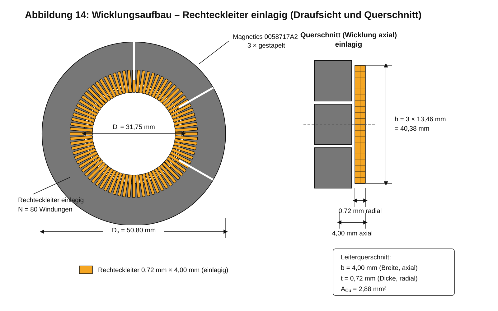

# 4 Wicklungsaufbau

| Parameter | Wert |
|---|---:|
| Windungszahl | 80 |
| Leiterart | Rechteckkupferleiter |
| Leiterabmessung | 0,72 mm × 4,00 mm |
| Wicklungsaufbau | einlagig |
| Leiterorientierung | 4,00 mm axial, 0,72 mm radial |
| Kupferquerschnitt | 2,88 mm² |
| Ersatz-Runddurchmesser | 1,915 mm |
| PLECS-Ersatz | $N_{Litze}=1$, $d_{Litze}=\sqrt{4A/\pi}$ |

Der Rechteckleiter besitzt den Kupferquerschnitt

$$A_{Cu}=0{,}72\,\mathrm{mm}\cdot4{,}00\,\mathrm{mm}=2{,}88\,\mathrm{mm^2}.$$

Die Wicklung wird in der dargestellten Vorzugsvariante einlagig ausgeführt. Die Leiterbreite von 4,00 mm liegt axial über der Höhe des dreifachen Kernstapels; die Leiterdicke von 0,72 mm wirkt radial. Die Darstellung zeigt 80 gleichmäßig über den Umfang verteilte Windungen.

*Abbildung 14: Schematische Draufsicht und axialer Querschnitt des einlagigen Wicklungsaufbaus mit 80 Windungen Rechteckleiter 0,72 mm × 4,00 mm auf drei gestapelten Magnetics-0058717A2-Ringkernen.*

Für Modelle, die nur einen Runddrahtdurchmesser akzeptieren, wird ein flächengleicher Ersatzdurchmesser verwendet:

$$d_{eq}=\sqrt{\frac{4A_{Cu}}{\pi}}=\sqrt{\frac{4\cdot0{,}72\cdot4}{\pi}}\approx1{,}915\,\mathrm{mm}.$$

Dieser Ersatzdurchmesser erhält den Gleichstromquerschnitt, bildet Skin- und Proximity-Effekt des Rechteckleiters jedoch nicht geometrisch korrekt ab. Für die Wicklungsfertigung sind Isolationsdicke, Biegeradius, Mindestabstand zwischen benachbarten Windungen und die tatsächlich nutzbare Fenstergeometrie separat zu verifizieren.
