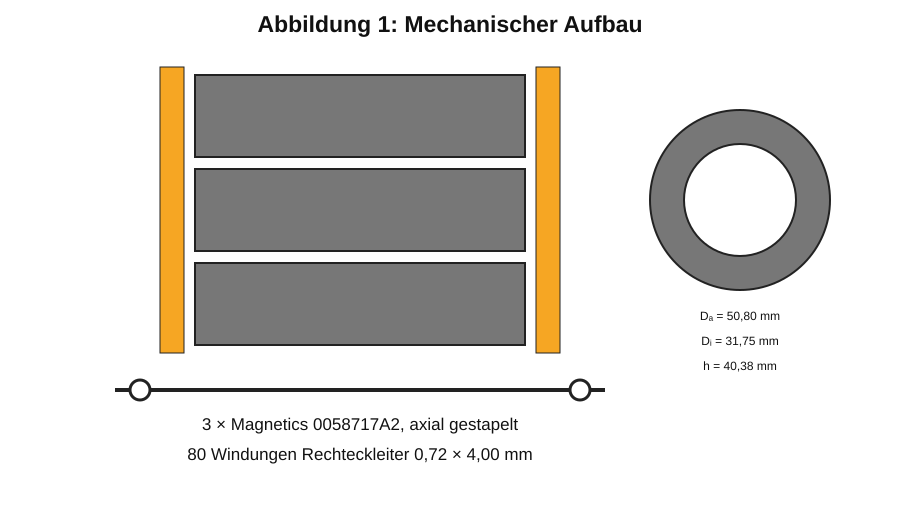

# 5 Mechanischer Aufbau

Der dreifache Kernstapel ist fluchtend auszurichten und mit elektrisch isolierendem, temperaturbeständigem Klebstoff zu verbinden. Zwischen Kernbeschichtung und Rechteckleiter ist ein geeigneter Kanten-, Abrieb- und Durchschlagschutz vorzusehen.

*Abbildung 1: Neu berechnete schematische Seiten- und Draufsicht des dreifachen Kernstapels mit einlagigem Rechteckleiter.*

Der Rechteckleiter darf beim Umformen weder scharf geknickt noch an den Kernkanten plastisch eingeschnürt werden. Anschlussbereiche sind separat mechanisch zu entlasten; die Drossel darf nicht über ihre elektrischen Anschlüsse befestigt werden.

Vor der Fertigung sind der Mindestbiegeradius, die tatsächliche Lack- oder Folienisolation und der Lagenaufbau anhand eines Wickelmusters zu bestätigen.
