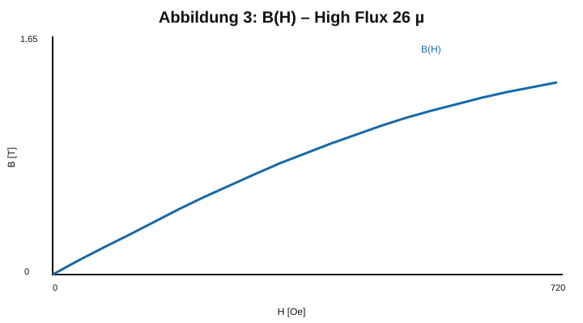
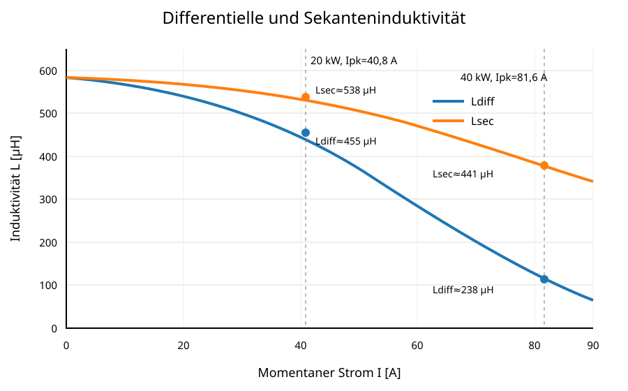
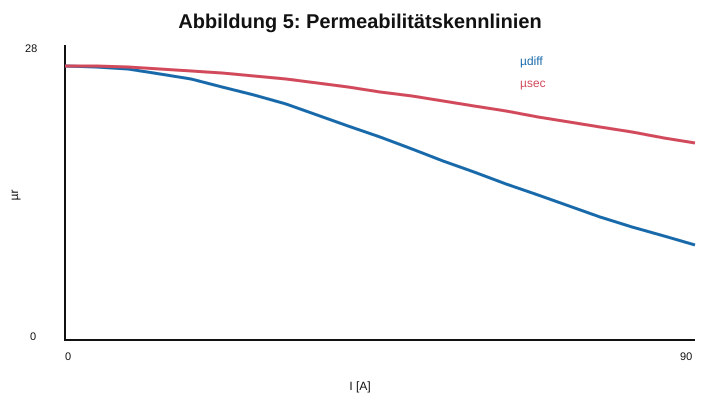

# 7 Magnetische Kennlinien

Die differentielle Induktivität ist für die Stromwelligkeit um den momentanen Arbeitspunkt maßgebend. Die Sekanteninduktivität beschreibt die Flussverkettung bezogen auf den Strom.

Für den Ursprung wird der projektspezifische Anfangswert angesetzt:

$$L_{diff}(0)=L_{sec}(0)=584\,\mu\mathrm{H}.$$

Die neu berechneten Kurven verwenden als glatte Entwurfsnäherung

$$B(H)=B_{sat}\tanh\left(\frac{\mu_0\mu_{r0}H}{B_{sat}}\right)$$

mit $\mu_{r0}=26$ und $B_{sat}=1{,}65\,\mathrm T$. Daraus werden differentielle und Sekantenwerte konsistent abgeleitet.

*Abbildung 3: Berechnete B(H)-Entwurfskennlinie für High Flux 26 µ mit markierten Arbeitspunkten.*

*Abbildung 4: Differentielle und Sekanteninduktivität über dem Strom, ausgehend von 584 µH bei 0 A.*

*Abbildung 5: Differentielle und Sekantenpermeabilität der verwendeten Entwurfsnäherung.*

Die Diagramme sind reproduzierbare Auslegungsnäherungen. Vor einer Fertigungsfreigabe sind sie durch Herstellerdaten oder eine gemessene $L(I)$- beziehungsweise B(H)-Kennlinie des dreifachen Kernstapels zu ersetzen oder zu bestätigen.
