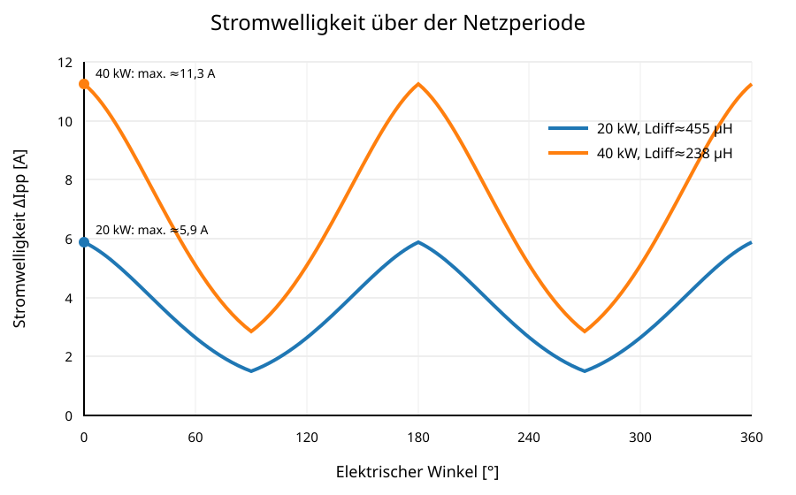

# 8 Stromwelligkeit und Flussdichtehub

Für eine lokale Schaltperiode wird die Stromwelligkeit näherungsweise mit

$$\Delta I_{pp}=\frac{V_L}{L_{diff}f_s}$$

berechnet. Wegen der stromabhängigen Permeabilität ist dabei die differentielle Induktivität am jeweiligen Arbeitspunkt einzusetzen.

Der Flussdichtehub folgt aus

$$\Delta B_{pp}=\frac{V_L}{NA_ef_s}.$$

Die folgenden Kurven wurden über eine vollständige Netzperiode mit dem vereinfachten phasenbezogenen PWM-Modell, $U_{DC}=750\,\mathrm V$, $f_s=70\,\mathrm{kHz}$, $N=80$ und $A_e=375\,\mathrm{mm^2}$ neu berechnet.

Die dargestellte maximale Stromwelligkeit liegt in dieser Näherung bei rund $5{,}05\,\mathrm A_{pp}$, der maximale Flussdichtehub bei rund $98\,\mathrm{mT}_{pp}$. SVM-Gleichtaktanteile, Totzeiten und diskrete Schaltzustände sind in dieser Darstellung noch nicht enthalten.
