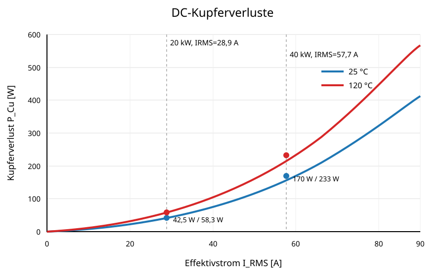

# 9 Elektrische Wicklungsverluste

## 9.1 Gleichstromwiderstand

Der Gleichstromwiderstand wird aus der tatsächlichen mittleren Windungslänge $l_{Cu}$ und dem Kupferquerschnitt bestimmt:

$$R_{DC,25}=\rho_{Cu,25}\frac{l_{Cu}}{A_{Cu}},$$

mit $A_{Cu}=2{,}88\,\mathrm{mm^2}$. Für die vorläufige Diagrammberechnung wurde aus dem dreifachen Kernstapel eine mittlere Windungslänge von etwa $105\,\mathrm{mm}$ und damit eine gesamte Kupferlänge von etwa $8{,}4\,\mathrm m$ angesetzt. Daraus folgt näherungsweise

$$R_{DC,25}\approx51{,}0\,\mathrm{m\Omega},\qquad R_{DC,120}\approx70{,}0\,\mathrm{m\Omega}.$$

Die Werte sind eine geometrische Vorabschätzung und müssen am Wickelmuster gemessen werden. Die hochfrequenten Zusatzverluste des 0,72 mm dicken Rechteckleiters sind wegen Skin- und Proximity-Effekt separat zu bestimmen; der flächengleiche Runddrahtdurchmesser im PLECS-Parametersatz ist dafür nur eine Näherung.
