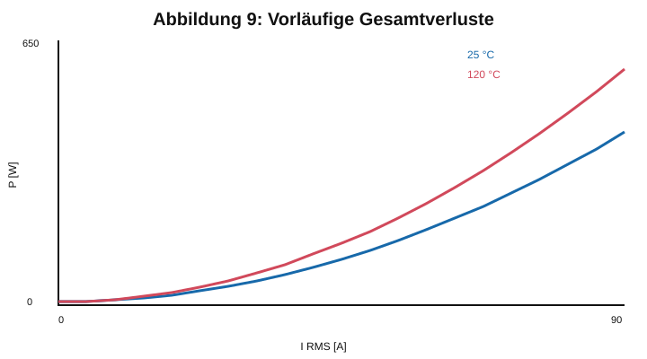

# 11 Gesamtverluste

Die Gesamtverluste ergeben sich aus

$$P_{ges}=P_{Cu,DC}+P_{Cu,HF}+P_{Kern}.$$

Für die neu berechnete Vorabschätzung wurden die DC-Kupferverluste aus $R_{DC,25}=51{,}0\,\mathrm{m\Omega}$ beziehungsweise $R_{DC,120}=70{,}0\,\mathrm{m\Omega}$ verwendet. Da für High Flux 26 µ noch keine validierten Steinmetzparameter hinterlegt sind, enthält die Kurve nur einen ausdrücklich als Platzhalter gekennzeichneten Kernverlustanteil.

Die Abbildung dient ausschließlich zum Vergleich der Größenordnung. Für die Freigabe müssen $P_{Cu,HF}$ und $P_{Kern}$ aus der realen Strom- und Flussdichtewellenform sowie validierten Materialdaten neu berechnet werden.
