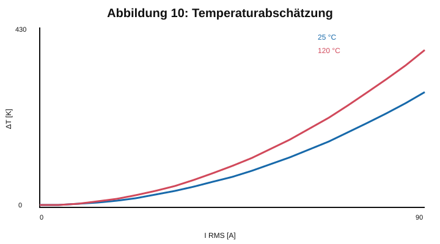

# 12 Thermik

Die thermische Auslegung basiert auf den Gesamtverlusten aus Kapitel 11 und dem thermischen Widerstand vom Kupfer beziehungsweise Kern zur Umgebung.

Für eine erste stationäre Abschätzung gilt

$$\Delta T=P_{ges}R_{th}.$$

Die neu berechnete Vorabschätzung verwendet beispielhaft $R_{th}=0{,}65\,\mathrm{K/W}$ und die vorläufigen Verlustkurven aus Kapitel 11.

Die dargestellten Werte sind keine thermische Freigabe. Wegen des dreifachen Kernstapels und der 80 Windungen ist die Luftführung durch die Kernöffnung und entlang der Wicklungsoberfläche besonders zu beachten. Die Freigabe erfordert Temperaturmessungen bei 20 kW Dauerbetrieb sowie einen 40-kW-Überlastversuch über 0,5 s; Wicklungs-, Kern- und Umgebungstemperatur sind getrennt zu erfassen.
