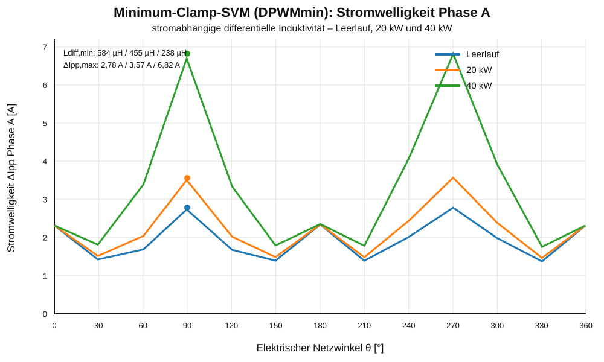
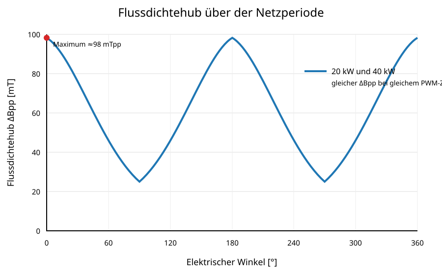

# PFC-Drossel 584 µH – 3 × Magnetics 0058717A2

**High Flux 26 µ · 80 Windungen · Rechteckleiter 0,72 × 4,00 mm · Minimum-Clamp-SVM**

Diese Revision ergänzt die schaltzustandsbasierte Berechnung der DPWMmin-Stromwelligkeit mit stromabhängiger differentieller Induktivität. Die unveränderten Fachkapitel bleiben als Einzelkapitel verlinkt; Kapitel 8 ist in dieser Gesamtausgabe vollständig enthalten.

## Inhaltsverzeichnis

1. [Zweck und Geltungsbereich](01_Zweck_und_Geltungsbereich.md)
2. [Systemanforderungen](02_Systemanforderungen.md)
3. [Magnetischer Aufbau](03_Magnetischer_Aufbau.md)
4. [Wicklungsaufbau](04_Wicklungsaufbau.md)
5. [Mechanischer Aufbau](05_Mechanischer_Aufbau.md)
6. [Berechnungsgrundlagen](06_Berechnungsgrundlagen.md)
7. [Magnetische Kennlinien](07_Magnetische_Kennlinien.md)
8. [Stromwelligkeit und Flussdichtehub](#8-stromwelligkeit-und-flussdichtehub)
9. [Elektrische Wicklungsverluste](09_Elektrische_Wicklungsverluste.md)
10. [Kernverluste](10_Kernverluste.md)
11. [Gesamtverluste](11_Gesamtverluste.md)
12. [Thermik](12_Thermik.md)
13. [Fertigung](13_Fertigung.md)
14. [Prüfung](14_Pruefung.md)
15. [PLECS-/MATLAB-Parametersatz](15_PLECS_MATLAB.md)
16. [Bewertung](16_Bewertung.md)
17. [Quellen](17_Quellen.md)

## Projektparameter

| Parameter | Wert |
|---|---:|
| Zielinduktivität | 584 µH |
| Kern | 3 × Magnetics 0058717A2 |
| Material | High Flux, µ = 26 |
| Windungszahl | 80 |
| Leiter | Rechteckkupfer 0,72 × 4,00 mm |
| Netzspannung | 400 V Leiter-Leiter |
| Zwischenkreisspannung | 750 V |
| Netzfrequenz | 50 Hz |
| Schaltfrequenz | 70 kHz |
| Nennleistung | 20 kW |
| Kurzzeitspitze | 40 kW für 0,5 s |

# 8 Stromwelligkeit und Flussdichtehub

## 8.1 Grundgleichungen

Die Stromwelligkeit wird innerhalb jeder PWM-Periode aus

$$\frac{di}{dt}=\frac{u_L}{L_{diff}(i)}$$

bestimmt. Für die schaltzustandsbasierte Berechnung wird die tatsächliche Phasendrosselspannung zeitdiskret integriert.

## 8.2 Minimum-Clamp-SVM

Für DPWMmin wird die gemeinsame Nullsystemkomponente

$$m_{cm}(\theta)=-1-\min\{m_a(\theta),m_b(\theta),m_c(\theta)\}$$

addiert. Damit gilt

$$m_{x,DPWMmin}=m_x+m_{cm},\qquad d_x=\frac{m_{x,DPWMmin}+1}{2}.$$

Die jeweils kleinste Phase wird für 120 elektrische Grad auf den negativen Zwischenkreis geklemmt.

## 8.3 Variable differentielle Induktivität

Die dokumentierte Entwurfsnäherung lautet

$$B(H)=B_{sat}\tanh\left(\frac{\mu_0\mu_{r0}H}{B_{sat}}\right)$$

und daraus

$$L_{diff}(I)=L_0\operatorname{sech}^2\left(\frac{\mu_0\mu_{r0}NI}{l_eB_{sat}}\right).$$

Das Referenzskript kann diese Gleichung durch eine CSV-Kennlinie aus Herstellerdaten oder Messwerten ersetzen.

## 8.4 Zeitdiskrete Auswertung

Eine Netzperiode enthält bei 50 Hz und 70 kHz 1400 PWM-Perioden. Jede PWM-Periode wird mit 240 Zeitschritten aufgelöst. Aus den drei Schaltzuständen wird

$$u_{conv,x}=U_{DC}\left(S_x-\frac{S_a+S_b+S_c}{3}\right)$$

berechnet. Nach Abzug des PWM-Mittelwerts wird die Ripple-Spannung integriert und

$$\Delta I_{pp,A}=\max(i_{ripple,A})-\min(i_{ripple,A})$$

bestimmt.

## 8.5 Ergebnis

*Abbildung 7a: Stromwelligkeit der Phase A für Leerlauf, 20 kW und 40 kW bei Minimum-Clamp-SVM und stromabhängiger differentieller Induktivität.*

| Arbeitspunkt | $I_{RMS}$ | $I_{pk}$ | $L_{diff,min}$ | $\Delta I_{pp,max}$ |
|---|---:|---:|---:|---:|
| Leerlauf | 0 A | 0 A | 584,0 µH | 2,78 A |
| 20 kW | 28,87 A | 40,82 A | 455,4 µH | 3,57 A |
| 40 kW | 57,74 A | 81,65 A | 238,4 µH | 6,82 A |

Die Maxima treten bei Phase A ungefähr bei 90 Grad und 270 Grad auf. Ursache ist die Kombination aus maximalem Grundwellenstrom, minimalem $L_{diff}$ und der DPWMmin-Schaltzustandsfolge.

## 8.6 Flussdichtehub

Der Flussdichtehub wird direkt aus dem Spannungs-Zeit-Integral bestimmt:

$$\Delta B_{pp}=\frac{1}{NA_e}\int u_L\,dt.$$

## Reproduzierbare Berechnung

- [Berechnungsgrundlage in der Formelsammlung](../../../Formelsammlung/Band_C/C9_DPWMmin_Stromwelligkeit.md)
- [Python-Referenzskript](../../../Formelsammlung/Band_C/C9_Skripte/dpwmmin_variable_ldiff.py)
- [CSV-Vorlage für Hersteller- oder Messdaten](../../../Formelsammlung/Band_C/C9_Skripte/ldiff_kennlinie_template.csv)

## Bildübersicht

- [Mechanischer Aufbau](Bilder/abbildung_01_mechanischer_aufbau.svg)
- [B(H)-Kennlinie](Bilder/abbildung_03_bh_kennlinie.svg)
- [Induktivitätskennlinien](Bilder/abbildung_04_induktivitaet.svg)
- [Permeabilitätskennlinien](Bilder/abbildung_05_permeabilitaet.svg)
- [Kupferverluste](Bilder/abbildung_06_kupferverluste.svg)
- [DPWMmin-Stromwelligkeit mit variablem Ldiff](Bilder/abbildung_07a_dpwmmin_stromwelligkeit_variable_induktivitaet.svg)
- [Flussdichtehub](Bilder/abbildung_08_flussdichtehub.svg)
- [Gesamtverluste](Bilder/abbildung_09_gesamtverluste.svg)
- [Temperaturabschätzung](Bilder/abbildung_10_temperaturabschaetzung.svg)
- [Einlagiger Rechteckleiter](Bilder/abbildung_14_wicklungsaufbau_rechteckleiter_einlagig.svg)
