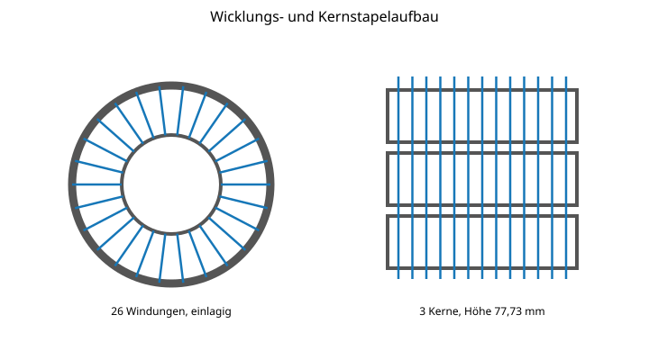
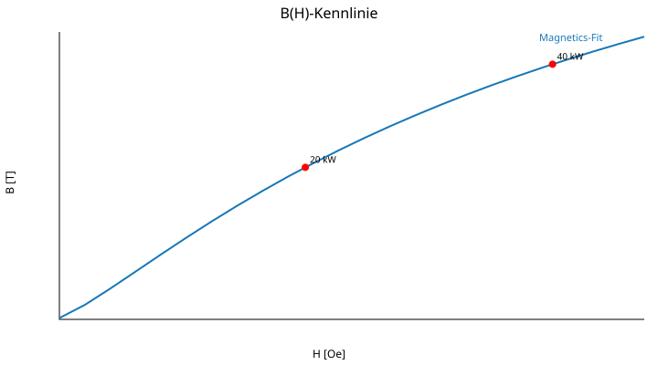
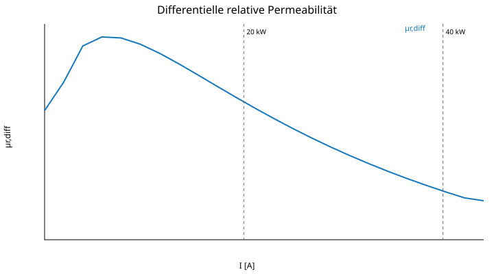
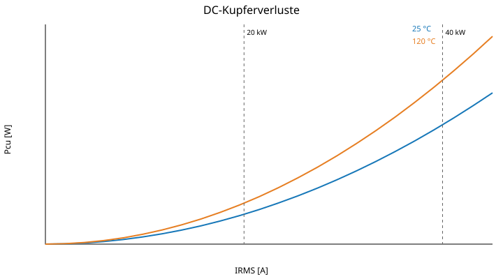
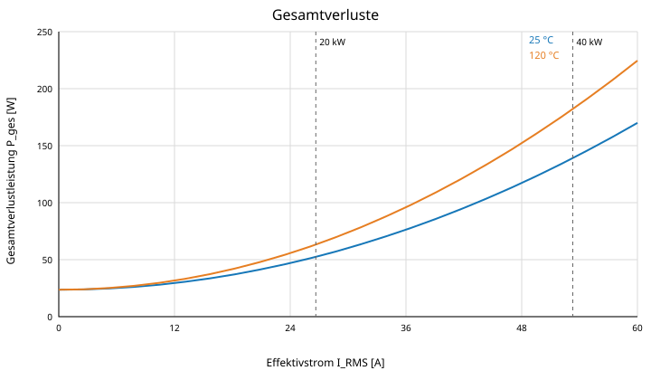

# Drossel-Spezifikationen – Beispiele – Gesamtausgabe

Diese Datei enthält die derzeit vorhandenen Beispielprojekte in einer fortlaufenden Leseansicht. Sie wurde aus den Einzelkapiteln des Beispielprojekts neu zusammengestellt.

**Zuletzt aktualisiert:** 29.07.2026, 18:57 Uhr CEST

## Inhaltsverzeichnis

### PFC-Drossel 20 kW – 3 × 64-mm-High-Flux-Ringkern

- [1 Zweck und Geltungsbereich](#1-zweck-und-geltungsbereich)
- [2 Systemanforderungen](#2-systemanforderungen)
- [3 Magnetischer Aufbau](#3-magnetischer-aufbau)
- [4 Wicklungsaufbau](#4-wicklungsaufbau)
- [5 Mechanischer Aufbau und Befestigung](#5-mechanischer-aufbau-und-befestigung)
- [6 Berechnungsgrundlagen](#6-berechnungsgrundlagen)
- [7 Magnetische Kennlinien](#7-magnetische-kennlinien)
- [8 Stromwelligkeit und Flussdichtehub](#8-stromwelligkeit-und-flussdichtehub)
- [9 Elektrische Wicklungsverluste](#9-elektrische-wicklungsverluste)
- [10 Kernverluste](#10-kernverluste)
- [11 Gesamtverluste](#11-gesamtverluste)
- [12 Thermische Anforderungen](#12-thermische-anforderungen)
- [13 Fertigungsanforderungen](#13-fertigungsanforderungen)
- [14 Prüf- und Abnahmekriterien](#14-prüf--und-abnahmekriterien)
- [15 PLECS-/MATLAB-Parametersatz](#15-plecs-matlab-parametersatz)
- [16 Bewertung und offene Verifikation](#16-bewertung-und-offene-verifikation)
- [17 Quellenbasis](#17-quellenbasis)

---

# PFC-Drossel 20 kW

**3 × 64-mm-High-Flux-Ringkern · 26 Windungen · 680 × 0,10-mm-HF-Litze**

Dieses Beispiel wurde aus der Entwicklungsspezifikation für eine dreiphasige 20-kW-Interleaved-PFC-Drossel in eine modulare GitHub-Markdown-Struktur übertragen.

## Projektübersicht

| Parameter | Wert |
|---|---:|
| Dokumentversion | 3.0 |
| Status | Entwurfs- und Berechnungsstand |
| Nennbetrieb | 20 kW, 3 × 400 V AC, 750 V DC |
| Kurzzeitüberlast | 40 kW für 0,5 s |
| Schaltfrequenz | 70 kHz |
| Kernaufbau | 3 gestapelte High-Flux-Ringkerne |
| Wicklung | 26 Windungen, 680 × 0,10 mm HF-Litze |

---

# 1 Zweck und Geltungsbereich

Dieses Dokument spezifiziert den magnetischen, elektrischen, mechanischen und thermischen Entwurfsstand einer PFC-Drossel für einen dreiphasigen 20-kW-Interleaved-PFC.

Es enthält die Berechnungsmodelle, Kennlinien, Fertigungsanforderungen und Prüfmerkmale für einen Aufbau aus drei gestapelten High-Flux-Ringkernen.

## 1.1 Magnetisches Berechnungsmodell

Die B(H)-Kennlinie und die daraus abgeleitete differentielle Induktivität werden mit der in der bereitgestellten Formelsammlung dokumentierten Magnetics-Herstellerfitfunktion berechnet.

Für den Stromrippel um einen DC-Arbeitspunkt ist die differentielle Induktivität maßgebend:

$$
L_{\mathrm{diff}} = \frac{\mathrm{d}\Psi}{\mathrm{d}I}
$$

Die Sekanteninduktivität dient ergänzend zur Bewertung der gespeicherten Flussverkettung:

$$
L_{\mathrm{sec}} = \frac{\Psi}{I}
$$

## 1.2 Gültigkeit

Die Spezifikation beschreibt einen Entwurfs- und Berechnungsstand. Die endgültige Bauteilfreigabe setzt die messtechnische Verifikation der magnetischen Kennlinie, der Wicklungsverluste, des thermischen Verhaltens und der mechanischen Ausführung voraus.

## 1.3 Abgrenzung

Die dokumentierten Werte gelten für die in den folgenden Kapiteln festgelegten Systemdaten, Kernabmessungen und Wicklungsdaten. Änderungen an Topologie, Modulation, Zwischenkreisspannung, Schaltfrequenz, Kernmaterial oder Wicklung erfordern eine erneute Bewertung.

---

# 2 Systemanforderungen

| Parameter | Wert |
|---|---:|
| Topologie | dreiphasiger Interleaved-PFC |
| Netzspannung | 3 × 400 V AC |
| Zwischenkreisspannung | 750 V DC |
| Nennleistung | 20 kW dauerhaft |
| Spitzenleistung | 40 kW für maximal 0,5 s |
| Schaltfrequenz | 70 kHz |
| Nennstrom pro betrachteter Phase | 28,87 A RMS |
| Spitzenlaststrom pro betrachteter Phase | 57,74 A RMS |

## 2.1 Betriebsfälle

### Nennbetrieb

Der Dauerbetrieb ist für eine Wirkleistung von 20 kW bei 3 × 400 V AC und einer Zwischenkreisspannung von 750 V DC spezifiziert. Der zugehörige Strom pro betrachteter Phase beträgt 28,87 A RMS.

### Kurzzeitüberlast

Für maximal 0,5 s ist eine Spitzenleistung von 40 kW vorgesehen. Der zugehörige Strom pro betrachteter Phase beträgt 57,74 A RMS.

## 2.2 Auslegungsrelevante Randbedingungen

Die magnetische und thermische Auslegung muss beide Betriebsfälle berücksichtigen. Der Dauerbetrieb ist für die stationäre Temperaturauslegung maßgebend. Die Kurzzeitüberlast ist auf Stromspitze, zusätzliche Verlustenergie und mögliche bleibende Änderungen der magnetischen oder mechanischen Eigenschaften zu prüfen.

---

# 3 Magnetischer Aufbau

| Parameter | Wert |
|---|---:|
| Kernmaterial | Magnetics High Flux, Permeabilitätsklasse 60 µ |
| Kernform | Ringkern, dreifach gestapelt |
| Außendurchmesser | 63,09 mm |
| Innendurchmesser | 31,70 mm |
| Höhe je Kern | 25,91 mm |
| Gesamte Kernhöhe | 77,73 mm |
| Effektiver Querschnitt $A_e$ | 1080 mm² |
| Effektive Weglänge $l_e$ | 144 mm |
| Effektives Kernvolumen $V_e$ | 155,5 cm³ |
| Anfangspermeabilität | 60 |
| Sättigungsflussdichte, Modellwert | 1,78 T |

## 3.1 Kernstapel

Die Drossel besteht aus drei geometrisch gleichen High-Flux-Ringkernen. Die Kerne werden axial gestapelt, sodass sich die wirksame Gesamthöhe auf 77,73 mm und der effektive magnetische Querschnitt auf 1080 mm² erhöht.

## 3.2 Geometrische Größen

$$
A_e = 1080\,\mathrm{mm^2} = 1{,}080\cdot10^{-3}\,\mathrm{m^2}
$$

$$
l_e = 144\,\mathrm{mm} = 0{,}144\,\mathrm{m}
$$

$$
V_e = 155{,}5\,\mathrm{cm^3}
$$

## 3.3 Materialmodell

Als Auslegungsannahme wird Magnetics High Flux mit einer Anfangspermeabilität von 60 verwendet. Für das nichtlineare Verhalten ist die Herstellerfitfunktion der B(H)-Kennlinie maßgebend. Die Sättigungsflussdichte von 1,78 T ist ein Modellwert und ersetzt nicht die Bewertung der nutzbaren Flussdichte bei den vorgesehenen Verlust- und Temperaturgrenzen.

## 3.4 Verifikation

Vor der Freigabe sind Kernbezeichnung, Beschichtungsabmessungen, effektive Magnetdaten und die tatsächlich eingesetzte Permeabilitätsklasse mit dem projektspezifischen Herstellerdatenblatt abzugleichen.

---

# 4 Wicklungsaufbau

| Parameter | Wert |
|---|---:|
| Windungszahl | 26 |
| Lagenzahl | 1 |
| Litze | 680 × 0,10 mm |
| Kupferquerschnitt | 5,341 mm² |
| angenommener maximaler Außendurchmesser | 3,65 mm |
| innerer Umfang | 99,59 mm |
| mittlere Teilung | 3,83 mm/Windung |
| Gesamtreserve am Innenumfang | 4,69 mm |
| mittlere Windungslänge, überschlägig | 304,4 mm |
| Leiterlänge einschließlich Anschlüsse | 8,31 m |

## 4.1 Wicklungsanordnung

Die 26 Windungen werden einlagig und gleichmäßig über den gesamten Umfang von 360° verteilt. Kreuzungen der Litze sind zu vermeiden.



*Abbildung 2: Drauf- und Seitenansicht des einlagigen Wicklungs- und Kernstapelaufbaus.*

$$
p = \frac{99{,}59\,\mathrm{mm}}{26} = 3{,}83\,\mathrm{mm/Windung}
$$

Bei einem maximalen Außendurchmesser der fertigen Litze von 3,65 mm verbleibt am Innenumfang eine rechnerische Gesamtreserve von 4,69 mm.

## 4.2 Leiterdaten

$$
A_{\mathrm{Cu}} = 680 \cdot \frac{\pi}{4} \cdot (0{,}10\,\mathrm{mm})^2
= 5{,}341\,\mathrm{mm^2}
$$

Die überschlägige mittlere Windungslänge beträgt 304,4 mm. Einschließlich Anschlusszuschlag wird eine gesamte Leiterlänge von 8,31 m angesetzt.

## 4.3 Fertigungsanforderungen

- Der garantierte maximale Außendurchmesser der fertigen Litze muss kleiner oder gleich 3,65 mm sein.
- Die Wicklung ist ohne Kreuzungen gleichmäßig über 360° zu verteilen.
- Anfang und Ende der Wicklung sind separat mechanisch zu entlasten.
- Die elektrischen Anschlüsse dürfen nicht als mechanische Halterung der Drossel dienen.
- Eine Beschädigung der Kernbeschichtung durch Zug, Druck oder Scheuern der Litze ist zu verhindern.

## 4.4 Offene Verifikation

Die Einlagigkeit ist anhand des realen Litzenaußendurchmessers, der Kernbeschichtung, zusätzlicher Isolierlagen und des Fertigungsprozesses am Muster zu bestätigen. Ebenso sind der DC-Widerstand und die HF-Zusatzverluste der realen Wicklung messtechnisch zu prüfen.

---

# 5 Mechanischer Aufbau und Befestigung

Der Kernstapel wird liegend auf einer elektrisch isolierenden Grundplatte montiert. Vorgesehen sind eine vollflächige beziehungsweise segmentierte Verklebung des Kernstapels und vier zusätzliche, nicht stromführende mechanische Befestigungspunkte. Die Grundplatte muss mindestens UL94 V-0 erfüllen. Zwischen Kernbeschichtung und Litze ist bei Bedarf eine zusätzliche abriebfeste Isolierlage vorzusehen.


*Abbildung 1: Vorgesehener mechanischer Aufbau der Drossel auf einer isolierenden Grundplatte.*

| Parameter | Wert |
|---|---|
| Empfohlene Grundplattenabmessung | ca. 84 × 84 mm, projektspezifisch anzupassen |
| Grundplattenmaterial | FR-4 oder gleichwertig, UL94 V-0 |
| Grundplattenstärke | 1,5 bis 2,0 mm |
| Mechanische Haltepunkte | 4 Durchsteckpunkte außerhalb des Kernaußendurchmessers |
| Kernbefestigung | hochtemperaturbeständiger, elektrisch isolierender Klebstoff |
| Mindestbauhöhe ohne Anschlussüberstand | ca. 86 bis 92 mm |

Die elektrischen Leistungsanschlüsse sind separat zugzuentlasten und dürfen nicht als mechanische Halterung dienen.

---

# 6 Berechnungsgrundlagen

## 6.1 Anfangsinduktivität

$$L_0 = \mu_0 \cdot \mu_{r,0} \cdot N^2 \cdot \frac{A_e}{l_e}$$

- $L_0 = 382{,}3\,\mu\text{H}$
- $A_L = 565{,}5\,\text{nH}/N^2$

## 6.2 Feldstärke

$$H[\text{Oe}] = \frac{4\pi \cdot N \cdot I[\text{A}]}{l_e[\text{mm}]}$$

$$H \approx 2{,}2689 \cdot I$$

## 6.3 Magnetics-B(H)-Fit

$$B(H)=\left[\frac{a+bH+cH^2}{1+dH+eH^2}\right]^x$$

| Parameter | Wert |
|---|---:|
| $a$ | 3,8280E−02 |
| $b$ | 1,8000E−02 |
| $c$ | 7,0120E−04 |
| $d$ | 7,0630E−02 |
| $e$ | 4,5020E−04 |
| $x$ | 1,630 |

## 6.4 Differentielle Induktivität

$$L_{\mathrm{diff}}(I)=N^2\frac{A_e}{l_e}\left[\frac{dB}{dH_{\mathrm{Oe}}}\cdot\frac{4\pi}{1000}\right]$$

## 6.5 Sekanteninduktivität

$$L_{\mathrm{sec}}(I)=N\,A_e\,\frac{B(H)-B(0)}{I}$$

---

# 7 Magnetische Kennlinien

- 20 kW bei $I_{pk}=40{,}82\,\text{A}$
- 40 kW für 0,5 s bei $I_{pk}=81{,}65\,\text{A}$

## 7.1 B(H)-Kennlinie



## 7.2 Differentielle und Sekanteninduktivität


## 7.3 Differentielle Permeabilität



| Strom | Feldstärke | Flussdichte | $L_{diff}$ | $L_{sec}$ |
|---:|---:|---:|---:|---:|
| 0,0 A | 0,0 Oe | 0,005 T | 203 µH | 382 µH |
| 28,9 A | 65,2 Oe | 0,386 T | 357 µH | 372 µH |
| 40,8 A | 92,5 Oe | 0,529 T | 311 µH | 361 µH |
| 57,7 A | 131,0 Oe | 0,699 T | 253 µH | 337 µH |
| 81,6 A | 185,5 Oe | 0,888 T | 192 µH | 303 µH |
| 90,0 A | 204,2 Oe | 0,941 T | 175 µH | 292 µH |

> Die Fitkurve liefert bei sehr kleinen Feldstärken einen kleinen Offset und eine lokale Anfangssteigung, die nicht exakt der nominellen Permeabilität 60 entspricht. Für die reale Bauteilfreigabe sind deshalb Messwerte von $L(I)$ maßgebend.

---

# 8 Stromwelligkeit und Flussdichtehub

Für die Worst-Case-Abschätzung eines idealen Boost-Zweigs wird der maximale Voltsekundenwert bei $V_{in}=V_{dc}/2$ angesetzt.

$$\Delta B_{pp,max}=\frac{V_{dc}}{4\,f\,N\,A_e}$$

Mit $V_{dc}=750\,\text{V}$, $f=70\,\text{kHz}$, $N=26$ und $A_e=1080\,\text{mm}^2$ folgt:

$$\Delta B_{pp,max}=95{,}4\,\text{mT}$$

Diese Abschätzung ist topologie- und modulationsabhängig. Für die endgültige Verlustrechnung ist der tatsächliche Spannungs- beziehungsweise Voltsekundenverlauf des verwendeten PFC-Zweigs aus PLECS über eine vollständige Netzperiode einzusetzen.

---

# 9 Elektrische Wicklungsverluste

$$R(T)=R_{25}\left[1+0{,}00393\,(T-25\,^{\circ}\mathrm{C})\right]$$

$$P_{Cu}=I_{RMS}^2\,R(T)$$



| Arbeitspunkt | Strom | $P_{Cu}$ bei 25 °C | $P_{Cu}$ bei 120 °C |
|---|---:|---:|---:|
| 20 kW Dauerbetrieb | 28,87 A RMS | 23,1 W | 31,7 W |
| 40 kW / 0,5 s | 57,74 A RMS | 92,3 W | 126,7 W |

HF-Zusatzverluste durch Skin- und Proximity-Effekt sind in diesen DC-Werten nicht enthalten.

---

# 10 Kernverluste

Verwendete Steinmetzgleichung gemäß der zugrunde liegenden Formelsammlung:

$$P_v=a\,f^b\,(\Delta B)^c$$

$$P_{core}=P_v\,V_e$$

| Parameter | Wert |
|---|---:|
| Steinmetz $a$ | 246,54 |
| Steinmetz $b$ | 2,218 |
| Steinmetz $c$ | 1,311 |
| Frequenz $f$ | 0,070 MHz |
| Worst-Case $\Delta B$ | 0,954 kG |
| Kernvolumen $V_e$ | 155,5 cm³ |
| Berechneter Worst-Case-Kernverlust | 98,9 W |

## 10.1 Kernverlust über dem Flussdichtehub


*Abbildung 7: Kernverlust über dem Flussdichtehub bei 70 kHz mit dem verwendeten Voltsekunden-Arbeitspunkt.*

## 10.2 Ergänzende Diagramme aus Entwicklungsspezifikation Revision 4.3

Die folgenden beiden Diagramme wurden aus der Entwicklungsspezifikation Revision 4.3 übernommen. Sie zeigen den Verlauf des hochfrequenten Flussdichtehubs und des daraus berechneten momentanen Kernverlusts über einer Netzperiode.

> **Hinweis zur Zuordnung:** Die Diagramme stammen aus der Variante mit 3 × Magnetics 0058111A2, 48 Windungen und $A_e=432\,\mathrm{mm^2}$. Sie dienen als ergänzende Darstellung der Berechnungsmethodik und sind nicht unmittelbar die Kennlinien des 3 × 64-mm-/26-Windungs-Beispiels.

### Flussdichtehub über einer Netzperiode


*Diagramm 4 aus Revision 4.3: Der berechnete Bereich beträgt $\Delta B_{pp}=31{,}2$ bis $129{,}2\,\mathrm{mT}$.*

### Kernverlust über einer Netzperiode


*Diagramm 5 aus Revision 4.3: Der über die Netzperiode gemittelte Kernverlust beträgt 4,0 W; der maximale momentane Rechenwert beträgt 9,2 W.*

> Die Einheitensetzung ist vor Serienfreigabe anhand der exakten Magnetics-Katalogseite zu bestätigen. Für die endgültige Verlustbewertung ist außerdem der reale Flussdichteverlauf aus der PLECS-Simulation über eine Netzperiode zu verwenden.

---

# 11 Gesamtverluste

$$P_{ges}=P_{Cu}+P_{core}$$



Nicht enthalten sind Wicklungs-HF-Verluste, Anschlussverluste, Streuflussverluste und temperaturabhängige Änderungen der Kernverlustparameter.

| Parameter | Wert |
|---|---:|
| Gesamtverlust 20 kW / 25 °C | 122,0 W |
| Gesamtverlust 20 kW / 120 °C | 130,6 W |
| Gesamtverlust 40 kW / 25 °C | 191,3 W |
| Gesamtverlust 40 kW / 120 °C | 225,7 W |

---

# 12 Thermische Anforderungen

Eine belastbare Temperaturberechnung erfordert den thermischen Widerstand des konkreten Einbaus, die Luftgeschwindigkeit, die Orientierung sowie die Wärmeleitung über Grundplatte und Anschlüsse. Deshalb wird in diesem Entwurfsstand keine scheinpräzise Endtemperatur vorgegeben. Die Freigabe erfolgt durch Messung.

| Parameter | Wert |
|---|---|
| Messstellen | Wicklungshotspot, Kernoberfläche, Klebstoffzone, Grundplatte, Anschluss |
| Lastpunkte | 25 %, 50 %, 75 %, 100 % Nennleistung |
| Überlastprüfung | 40 kW für 0,5 s aus thermisch eingeschwungenem Nennbetrieb |
| Temperaturlimit Wicklung | gemäß Isolationssystem mit mindestens 20 K Designreserve |
| Temperaturlimit Klebstoff | unterhalb Hersteller-Dauergrenze mit Reserve |
| Kühlung | projektspezifisch; Luftstrom dokumentieren |

---

# 13 Fertigungsanforderungen

1. Kerne vor dem Stapeln auf Beschädigungen der Beschichtung prüfen.
2. Die drei Kerne fluchtend stapeln und mit elektrisch isolierendem Hochtemperaturklebstoff verbinden.
3. Eine zusätzliche abriebfeste Kernisolation verwenden, falls die Kernbeschichtung allein nicht für die Wickelbeanspruchung qualifiziert ist.
4. 26 Windungen einlagig, gleichmäßig über 360° und ohne Überkreuzung wickeln.
5. Litzenenden fachgerecht abisolieren, verzinnen beziehungsweise mit geeigneten Crimpanschlüssen versehen und mechanisch zugentlasten.
6. Die Drossel auf einer isolierenden Grundplatte verkleben und mit vier zusätzlichen mechanischen Haltepunkten gegen Vibration sichern.
7. Das Bauteil dauerhaft mit Typ, Losnummer, Windungszahl und Prüfstatus kennzeichnen.

---

# 14 Prüf- und Abnahmekriterien

| Prüfung | Bedingung | Kriterium | Dokumentation |
|---|---|---|---|
| Sichtprüfung | 100 % | keine Beschädigung, keine Kreuzung, sichere Zugentlastung | Prüfprotokoll |
| Windungszahl | 100 % oder prozesssicher | 26 Windungen | Prüfprotokoll |
| Anfangsinduktivität | Kleinsignal, definierte Frequenz | Sollwert nach Musterfreigabe | Messwert |
| L(I)-Kennlinie | 0 bis mindestens 90 A | innerhalb freigegebenem Kennlinienband | Kurve |
| $R_{DC}$ | 25 °C | Zielwert ca. 27,7 mΩ, Toleranz nach Muster | Messwert |
| Isolationsprüfung | nach Isolationskonzept | kein Durchschlag oder Überschlag | Prüfprotokoll |
| Temperaturtest | 20 kW stationär | Grenzwerte des Isolationssystems eingehalten | Temperaturkurve |
| Kurzzeitüberlast | 40 kW, 0,5 s | keine bleibende Änderung oder Beschädigung | Vor-/Nachmessung |

---

# 15 PLECS-/MATLAB-Parametersatz

```matlab
D_a_mm = 63.09;
D_i_mm = 31.70;
h_mm = 3*25.91;
N_Wdg = 26;
N_Litze = 680;
d_Litze_mm = 0.10;
A_mag = 3*360e-6;
l_mag_mm = 144;
mu_r_0 = 60;
mu_r_sat = 1;
B_sat = 1.78;

a_BH = 3.8280E-02;
b_BH = 1.8000E-02;
c_BH = 7.0120E-04;
d_BH = 7.0630E-02;
e_BH = 4.5020E-04;
x_BH = 1.630;

a_StMetz = 246.54;
b_StMetz = 2.218;
c_StMetz = 1.311;
```

---

# 16 Bewertung und offene Verifikation

Der Aufbau ist mechanisch deutlich plausibler als die zuvor betrachtete 80-Windungs-Variante. Die 26 Windungen können bei einem garantierten Litzenaußendurchmesser bis 3,65 mm einlagig ausgeführt werden.

## Offene Verifikationspunkte

- Exakte Einheitensetzung der verwendeten Steinmetzparameter
- Realer Spannungs- und Voltsekundenverlauf des verwendeten PFC-Zweigs
- HF-Wicklungsverluste durch Skin- und Proximity-Effekt
- Thermische Randbedingungen des konkreten Einbaus
- Gemessene L(I)-Kennlinie von 0 bis mindestens 90 A
- Reale Litzenaußenabmessung und Einlagigkeit der Wicklung
- Dauerfestigkeit von Verklebung, Isolationslagen und mechanischen Haltepunkten

---

# 17 Quellenbasis

## Projektspezifische Grundlage

- Entwicklungsspezifikation **„Entwicklungsspezifikation_PFC_Drossel_3x64mm_26Wdg_mit_Arbeitspunkten“**, Dokumentversion 3.0.
- Entwicklungsspezifikation **„Entwicklungsspezifikation_PFC_Drossel_Rev4_4_final“**, Revision 4.3, als Quelle für die ergänzenden Diagramme zum Flussdichtehub und Kernverlust über der Netzperiode.

## Berechnungsgrundlage

- Formelsammlung Drosselauslegung – Magnetics High Flux mit B(H)-Formeln.

## Herstellerinformationen

- Magnetics: öffentliche Designhinweise zu Powder-Core- und PFC-Auslegungen.

> Die Bauteilfreigabe muss auf den projektspezifischen Herstellerdatenblättern, der dokumentierten Simulation und den Messungen am realen Muster basieren.