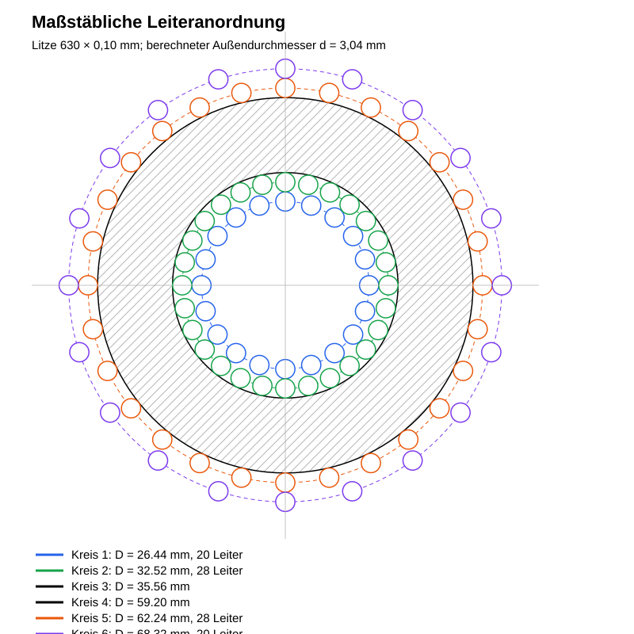

# 4 Wicklungsaufbau

| Parameter | Wert |
|---|---:|
| Windungszahl | 48 |
| Lagenaufteilung | 28 + 20 |
| Lagenzahl | 2 |
| Litze | 630 × 0,10 mm |
| Kupferquerschnitt | 4,948 mm² |
| Berechneter Litzenaußendurchmesser | 3,04 mm |

Die Wicklung wird zweilagig ausgeführt. Die erste Lage umfasst 28 Windungen, die zweite Lage 20 Windungen. Zwischen den Lagen ist eine geeignete Isolier- und Abriebschutzlage vorzusehen.


*Abbildung 2: Drauf- und Seitenansicht des zweilagigen Wicklungsaufbaus mit 28 + 20 Windungen auf drei gestapelten Kernen.*

## Mathematisch berechnete Leiterpositionen

Für jeden Leiter auf einem Kreis mit Radius $r_k$ und $N_k$ gleichmäßig verteilten Leitern gilt

```math
\theta_{k,j}=\frac{2\pi j}{N_k},\qquad j=0,1,\ldots,N_k-1,
```

```math
x_{k,j}=r_k\cos(\theta_{k,j}),\qquad
y_{k,j}=r_k\sin(\theta_{k,j}).
```

Die Leiter werden als Kreise mit dem berechneten Außendurchmesser $d_L=3{,}04\,\mathrm{mm}$ dargestellt. Kreis 1 und Kreis 6 enthalten jeweils 20 Leiter, Kreis 2 und Kreis 5 jeweils 28 Leiter.

| Kreis | Funktion | Leiterzahl | Radius | Durchmesser |
|---:|---|---:|---:|---:|
| 1 | zweite Innenlage | 20 | 13,22 mm | 26,44 mm |
| 2 | erste Innenlage | 28 | 16,26 mm | 32,52 mm |
| 3 | Innendurchmesser des beschichteten Kerns | – | 17,78 mm | 35,56 mm |
| 4 | Außendurchmesser des beschichteten Kerns | – | 29,60 mm | 59,20 mm |
| 5 | erste Außenlage | 28 | 31,12 mm | 62,24 mm |
| 6 | zweite Außenlage | 20 | 34,16 mm | 68,32 mm |



*Abbildung 14: Maßstäbliche Draufsicht der berechneten Leiterquerschnitte. Die Mittelpunkte liegen exakt auf den vier berechneten Leiterkreisen; jeder Leiterkreis besitzt den Außendurchmesser 3,04 mm.*

Kreuzungen, lokale Bündelungen und scharfkantige Umlenkungen sind zu vermeiden. Anfang und Ende der Wicklung müssen separat zugentlastet werden.