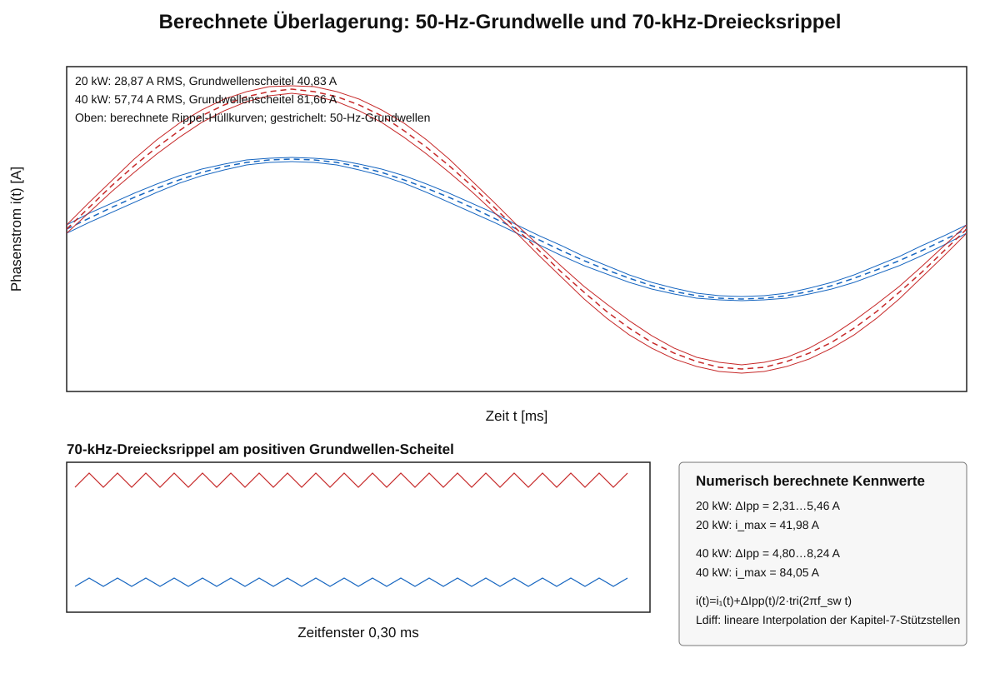

# 8 Stromwelligkeit und Flussdichtehub

## 8.1 Phasenspannung und Tastgrad

Für das vereinfachte phasenbezogene Zweilevel-PWM-Modell gilt

$$u_{Phase}(t)=\hat U_{Phase}\sin(2\pi f_{Netz}t)$$

mit

$$\hat U_{Phase}=\frac{\sqrt{2}\,U_{LL,rms}}{\sqrt{3}}=326{,}6\,\mathrm{V}.$$

Der Tastgrad lautet

$$d(t)=0{,}5+\frac{u_{Phase}(t)}{U_{DC}}.$$

Bei $U_{DC}=750\,\mathrm{V}$ gilt

$$d_{min}=0{,}0645,\qquad d_{max}=0{,}9355.$$

## 8.2 Stromwelligkeit bei konstanter Anfangsinduktivität

Aus der Voltsekundenbilanz folgt

$$\Delta I_{pp}(t)=\frac{U_{DC}\,d(t)\,[1-d(t)]}{L\,f_s}.$$

Für $L=L_0=525\,\mu\mathrm{H}$ ergeben sich

$$\Delta I_{pp,max}=5{,}10\,\mathrm{A}$$

bei $d=0{,}5$ und

$$\Delta I_{pp,min}=1{,}23\,\mathrm{A}$$

am Scheitel der Netzphasenspannung.

*Abbildung 6: Spitze-Spitze-Stromwelligkeit über dem Netzwinkel bei konstanter Anfangsinduktivität.*

## 8.3 Stromwelligkeit mit arbeitspunktabhängiger differentieller Induktivität

Der Grundwellenstrom lautet

$$i_1(t)=\hat I_1\sin(2\pi f_{Netz}t)$$

mit

$$\hat I_1=\sqrt{2}\,I_{1,rms}.$$

Damit gilt

$$L_{diff}(t)=L_{diff}\!\left(\left|i_1(t)\right|\right)$$

und

$$\Delta I_{pp}(t)=\frac{U_{DC}\,d(t)\,[1-d(t)]}{L_{diff}\!\left(\left|i_1(t)\right|\right)\,f_s}.$$

Für die numerische Berechnung werden die korrigierten Stützstellen aus Kapitel 7 linear interpoliert:

| Strom | $L_{diff}$ |
|---:|---:|
| 0,0 A | 525 µH |
| 28,9 A | 364 µH |
| 40,8 A | 280 µH |
| 57,7 A | 202 µH |
| 81,6 A | 135 µH |
| 90,0 A | 119 µH |

Daraus ergeben sich:

| Betriebspunkt | $\hat I_1$ | $\Delta I_{pp,min}$ | $\Delta I_{pp,max}$ |
|---|---:|---:|---:|
| 20 kW, 28,87 A RMS | 40,83 A | 2,31 A | 5,46 A |
| 40 kW, 57,74 A RMS | 81,66 A | 4,80 A | 8,24 A |

Die früher angegebenen Maximalwerte von $9{,}60\,\mathrm{A}$ beruhten auf dem nicht korrigierten Wert $L_{diff}(0)\approx279\,\mu\mathrm{H}$ und sind nach der Korrektur von Kapitel 7 nicht mehr konsistent.

*Abbildung 7: Arbeitspunktabhängige Spitze-Spitze-Stromwelligkeit mit der korrigierten differentiellen Induktivität.*

## 8.4 Zeitverlauf aus 50-Hz-Grundwelle und 70-kHz-Dreiecksrippel

Der normierte symmetrische Dreiecksträger besitzt den Wertebereich $-1\ldots+1$:

$$\operatorname{tri}(t)=4\left|\left(f_s t\bmod1\right)-\frac12\right|-1.$$

Der überlagerte Phasenstrom wird für jeden Zeitpunkt numerisch berechnet:

$$i(t)=i_1(t)+\frac{\Delta I_{pp}(t)}{2}\operatorname{tri}(t).$$

Die Rippelamplitude bezüglich der Grundwelle beträgt

$$\hat I_{Ripple}(t)=\frac{\Delta I_{pp}(t)}{2}.$$

Die momentanen Grenzen lauten

$$i_{oben}(t)=i_1(t)+\frac{\Delta I_{pp}(t)}{2}$$

und

$$i_{unten}(t)=i_1(t)-\frac{\Delta I_{pp}(t)}{2}.$$

*Abbildung 9: Numerisch berechnete Überlagerung der 50-Hz-Grundwelle mit dem netzwinkel- und arbeitspunktabhängigen 70-kHz-Dreiecksrippel. Oben sind die berechneten Rippel-Hüllkurven über eine vollständige Netzperiode dargestellt; unten ist der 70-kHz-Verlauf am positiven Grundwellen-Scheitel vergrößert.*

| Betriebspunkt | Grundwellen-Scheitel | maximaler Gesamtstrom | minimaler Gesamtstrom |
|---|---:|---:|---:|
| 20 kW | 40,83 A | 41,98 A | −41,98 A |
| 40 kW | 81,66 A | 84,05 A | −84,05 A |

Die Maximalwerte des Gesamtstroms sind nicht allgemein gleich $\hat I_1+\Delta I_{pp,max}/2$, weil das Maximum der Rippelbreite und der Scheitel der Grundwelle zeitlich nicht zwingend zusammenfallen. Die Werte werden direkt aus der zeitdiskreten Kurve bestimmt.

Die vollständige reproduzierbare Berechnung liegt in `Berechnungen/stromverlauf_50Hz_70kHz.py`. Die verwendeten Stützstellen und Ergebniskennwerte stehen in `Daten/stromverlauf_50Hz_70kHz_kennwerte.csv`.

## 8.5 Flussdichtehub aus der Stromwelligkeit

Für jeden Zeitpunkt gilt

$$\Delta B_{pp}(t)=\frac{L_{diff}(t)\,\Delta I_{pp}(t)}{N\,A_e}.$$

Durch Einsetzen kürzt sich $L_{diff}(t)$ heraus:

$$\Delta B_{pp}(t)=\frac{U_{DC}\,d(t)\,[1-d(t)]}{N\,A_e\,f_s}.$$

Mit $U_{DC}=750\,\mathrm{V}$, $N=48$, $A_e=432\,\mathrm{mm^2}$ und $f_s=70\,\mathrm{kHz}$ folgt

$$\Delta B_{pp,max}=129{,}175\,\mathrm{mT}$$

und

$$\Delta B_{pp,min}=31{,}193\,\mathrm{mT}.$$

| Betriebspunkt | $\Delta B_{pp,min}$ | $\Delta B_{pp,max}$ | $B_{pk,min}$ | $B_{pk,max}$ |
|---|---:|---:|---:|---:|
| 20 kW | 31,193 mT | 129,175 mT | 15,597 mT | 64,588 mT |
| 40 kW | 31,193 mT | 129,175 mT | 15,597 mT | 64,588 mT |

*Abbildung 8: Der Flussdichtehub ist bei konsistenter Rechnung für beide Lastfälle identisch.*

## 8.6 Konsequenz für die Kernverlustberechnung

Da $B_{pk}(t)=\Delta B_{pp}(t)/2$ für 20 kW und 40 kW identisch ist, entstehen im bisher verwendeten Steinmetz-Modell identische Kernverlustkurven. Das Modell berücksichtigt in dieser Form keinen zusätzlichen Einfluss der DC-Vormagnetisierung auf die Steinmetz-Parameter.

Für die endgültige Auslegung ist der reale Voltsekunden- und Flussdichteverlauf aus der PLECS-Schaltsimulation zu verwenden.
