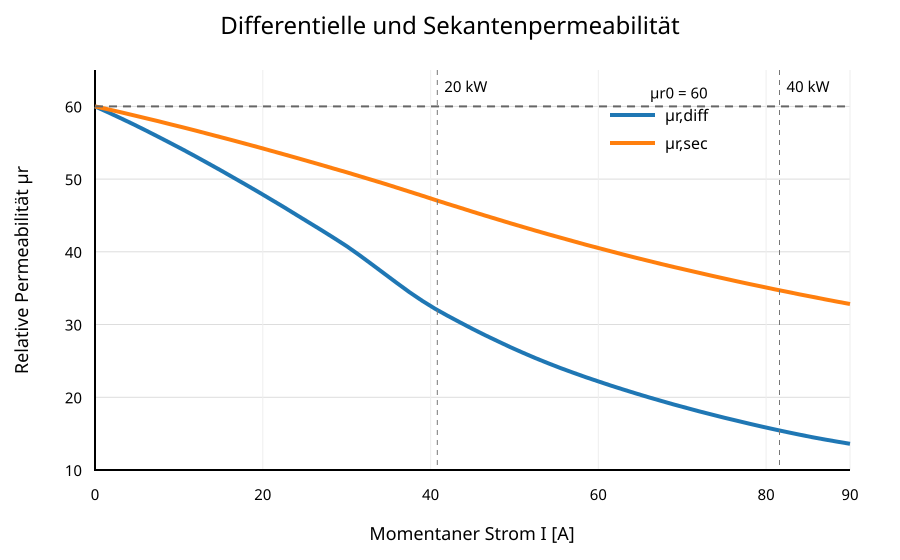
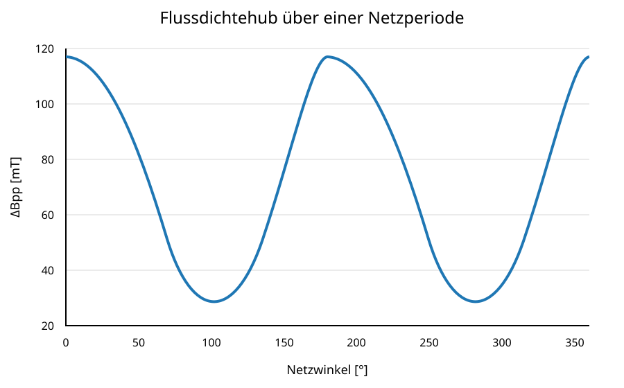
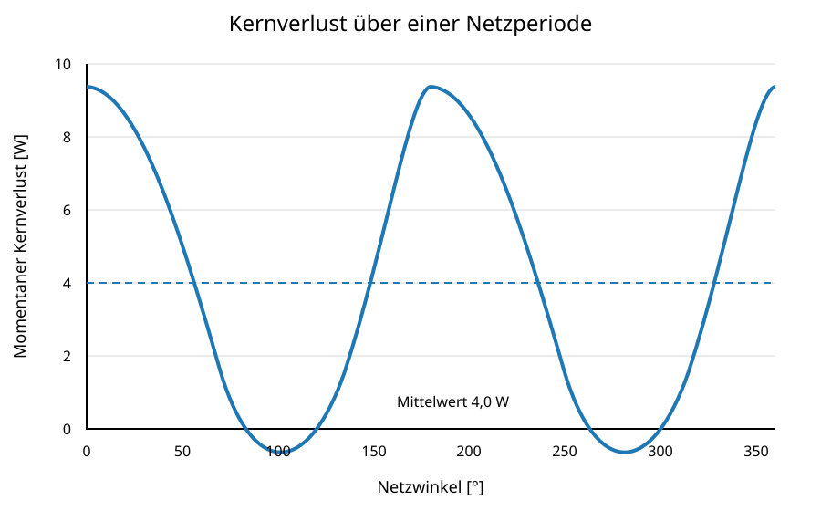
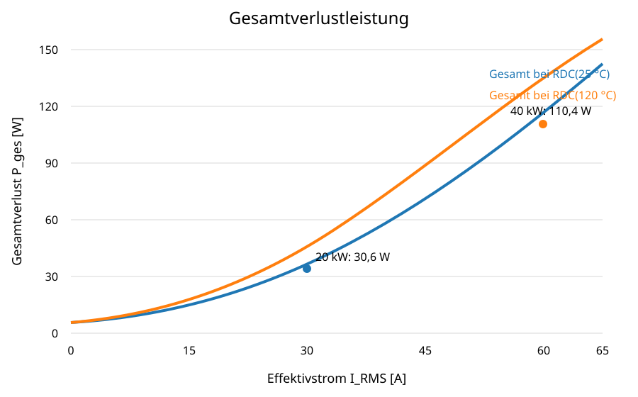

# PFC-Drossel 525 µH – Gesamtausgabe

**3 × Magnetics C058110A2 · High Flux 60 µ · 48 Windungen · 28 + 20 · Litze 630 × 0,10 mm**

Diese Datei fasst alle Einzelkapitel des Beispielprojekts in einer fortlaufenden Leseansicht zusammen.

## Inhaltsverzeichnis

1. [Zweck und Geltungsbereich](#1-zweck-und-geltungsbereich)
2. [Systemanforderungen](#2-systemanforderungen)
3. [Magnetischer Aufbau](#3-magnetischer-aufbau)
4. [Wicklungsaufbau](#4-wicklungsaufbau)
5. [Mechanischer Aufbau](#5-mechanischer-aufbau)
6. [Berechnungsgrundlagen](#6-berechnungsgrundlagen)
7. [Magnetische Kennlinien](#7-magnetische-kennlinien)
8. [Stromwelligkeit und Flussdichtehub](#8-stromwelligkeit-und-flussdichtehub)
9. [Elektrische Wicklungsverluste](#9-elektrische-wicklungsverluste)
10. [Kernverluste](#10-kernverluste)
11. [Gesamtverluste](#11-gesamtverluste)
12. [Thermik](#12-thermik)
13. [Fertigung](#13-fertigung)
14. [Prüfung](#14-prüfung)
15. [PLECS-/MATLAB-Parametersatz](#15-plecs-matlab-parametersatz)
16. [Bewertung](#16-bewertung)
17. [Quellen](#17-quellen)

---

# 1 Zweck und Geltungsbereich

Dieses Beispiel dokumentiert den Entwurfsstand einer dreiphasigen PFC-Drossel mit etwa 525 µH Anfangsinduktivität, drei gestapelten Magnetics-C058110A2-Kernen und 48 Windungen HF-Litze.

---

# 2 Systemanforderungen

| Parameter | Wert |
|---|---:|
| Netzspannung | 400 V Leiter-Leiter |
| Zwischenkreisspannung | 750 V DC |
| Schaltfrequenz | 70 kHz |
| Nennleistung | 20 kW dauerhaft |
| Spitzenleistung | 40 kW für 0,5 s |
| Nennstrom | 28,87 A RMS |
| Spitzenlaststrom | 57,74 A RMS |

---

# 3 Magnetischer Aufbau

| Parameter | Wert |
|---|---:|
| Kern | 3 × Magnetics C058110A2 |
| Material | High Flux, µ = 60 |
| Außendurchmesser | 57,15 mm |
| Innendurchmesser | 35,56 mm |
| Höhe je Kern | 13,97 mm |
| Gesamthöhe | 41,91 mm |
| Effektiver Querschnitt | 432 mm² |
| Effektive Weglänge | 143 mm |
| Kernvolumen | 61,78 cm³ |
| Modellwert $B_{sat}$ | 1,78 T |

---

# 4 Wicklungsaufbau

| Parameter | Wert |
|---|---:|
| Windungszahl | 48 |
| Lagenaufteilung | 28 + 20 |
| Lagenzahl | 2 |
| Litze | 630 × 0,10 mm |
| Kupferquerschnitt | 4,948 mm² |


*Abbildung 1: Zweilagiger Wicklungsaufbau mit 28 Windungen in der ersten und 20 Windungen in der zweiten Lage.*

---

# 5 Mechanischer Aufbau

Die drei Kerne sind fluchtend zu stapeln, elektrisch isolierend zu verkleben und gegen Beschädigung durch die zweilagige Wicklung zu schützen. Die Anschlüsse sind separat zugzuentlasten.


*Abbildung 2: Schematischer mechanischer Aufbau der Drossel.*

---

# 6 Berechnungsgrundlagen

$$L_0\approx525\,\mu\mathrm{H}$$

$$H[\mathrm{Oe}]=\frac{4\pi NI}{l_e[\mathrm{mm}]}$$

$$d=0{,}5+\frac{v_{Phase}}{V_{DC}}$$

$$\Delta B_{pp}=\frac{V_{DC}d(1-d)}{NA_ef_s}$$

---

# 7 Magnetische Kennlinien

Die differentielle Induktivität ist für die Stromwelligkeit maßgebend. Der AL-basierte Anfangswert von etwa 525 µH wird separat betrachtet. Die reale $L(I)$-Kennlinie ist bis mindestens 90 A zu messen.


*Abbildung 3: B(H)-Kennlinie des verwendeten High-Flux-Modells.*


*Abbildung 4: Differentielle und Sekanteninduktivität über dem Strom.*



*Abbildung 5: Differentielle relative Permeabilität über dem Strom.*

---

# 8 Stromwelligkeit und Flussdichtehub

Berechneter Bereich:

- $\Delta B_{pp}=31{,}2$ bis $129{,}2\,\mathrm{mT}$
- $B_{pk}=15{,}6$ bis $64{,}6\,\mathrm{mT}$



*Abbildung 6: Berechneter Flussdichtehub über dem Netzwinkel.*

---

# 9 Elektrische Wicklungsverluste

| Betrieb | $P_{Cu}$ 25 °C | $P_{Cu}$ 120 °C |
|---|---:|---:|
| 20 kW | 19,3 W | 26,6 W |
| 40 kW | 77,3 W | 106,4 W |


*Abbildung 7: DC-Kupferverluste bei 25 °C und 120 °C.*

---

# 10 Kernverluste

$$P_v[\mathrm{mW/cm^3}]=246{,}54\cdot B[\mathrm{T}]^{2{,}218}\cdot f[\mathrm{kHz}]^{1{,}311}$$

Der mittlere Kernverlust beträgt 4,0 W, der maximale momentane Rechenwert 9,2 W.



*Abbildung 8: Momentaner Kernverlust über dem Netzwinkel mit Mittelwert 4,0 W.*


*Abbildung 9: Kernverlust über dem Flussdichtehub bei 70 kHz.*

---

# 11 Gesamtverluste

| Betrieb | $P_{ges}$ bei 120 °C |
|---|---:|
| 20 kW | 30,6 W |
| 40 kW | 110,4 W |



*Abbildung 10: Gesamtverluste über dem Effektivstrom.*

---

# 12 Thermik

Für 20 kW Dauerbetrieb wird ein maximaler thermischer Widerstand von etwa 3,11 K/W angegeben. Mit 800 J/K angenommener Wärmekapazität beträgt der adiabatische Temperaturanstieg während 0,5 s Spitzenlast etwa 0,069 K.


*Abbildung 11: Adiabatische Temperaturerhöhung während der 0,5-s-Spitzenlast.*

---

# 13 Fertigung

Kerne prüfen, fluchtend stapeln und isolierend verkleben. Erste Lage mit 28 Windungen wickeln, Lagenisolation aufbringen und zweite Lage mit 20 Windungen ergänzen. Anschlüsse fachgerecht kontaktieren und zugentlasten.

---

# 14 Prüfung

Zu prüfen sind Sichtzustand, 48 Windungen mit Aufteilung 28 + 20, Anfangsinduktivität, $L(I)$, $R_{DC}$, Isolation, stationärer Temperaturbetrieb und Kurzzeitüberlast.

---

# 15 PLECS-/MATLAB-Parametersatz

```matlab
D_a_mm = 57.15;
D_i_mm = 35.56;
h_mm = 3*13.97;
N_Wdg = 48;
N_Litze = 630;
d_Litze_mm = 0.10;
A_mag = 3*144e-6;
l_mag_mm = 143;
mu_r_0 = 60;
mu_r_sat = 1;
B_sat = 1.78;
a_StMetz = 246.54;
b_StMetz = 2.218;
c_StMetz = 1.311;
U_LL_rms = 400;
U_DC = 750;
f_sw = 70e3;
```

---

# 16 Bewertung

Der Aufbau ist elektrisch plausibel, muss jedoch hinsichtlich $L(I)$, AC-Wicklungsverlusten, Lagenisolation, thermischer Anbindung und mechanischer Dauerfestigkeit am Muster verifiziert werden.

---

# 17 Quellen

- Entwicklungsspezifikation „Entwicklungsspezifikation_PFC_Drossel_Rev4_4_final“, Revision 4.3.
- Magnetics High Flux 60 µ, Kern C058110A2.
- Projektinterne Formelsammlung zur Drosselauslegung.
