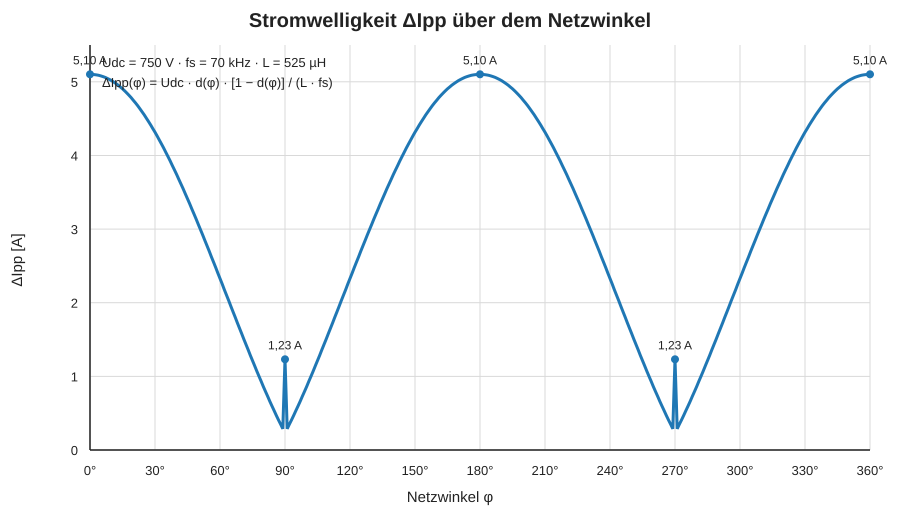
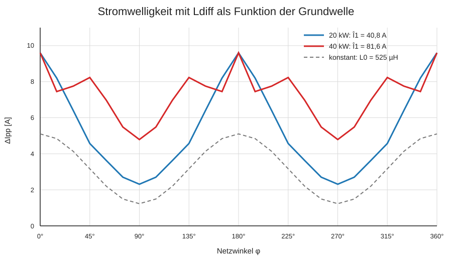
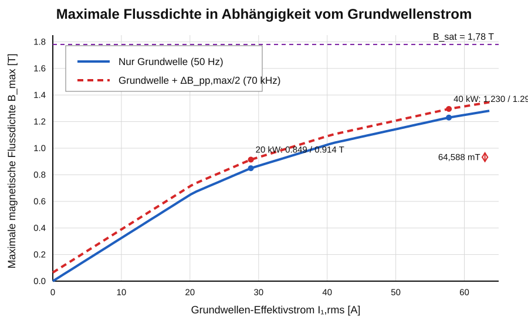

# PFC-Drossel 525 µH – Gesamtausgabe

**3 × Magnetics C058110A2 · High Flux 60 µ · 48 Windungen · 28 + 20 · Litze 630 × 0,10 mm**

Diese Datei fasst alle Einzelkapitel des Beispielprojekts in einer fortlaufenden Leseansicht zusammen.

## Inhaltsverzeichnis

1. [Zweck und Geltungsbereich](#1-zweck-und-geltungsbereich)
2. [Systemanforderungen](#2-systemanforderungen)
3. [Magnetischer Aufbau](#3-magnetischer-aufbau)
4. [Wicklungsaufbau](#4-wicklungsaufbau)
5. [Mechanischer Aufbau](#5-mechanischer-aufbau)
6. [Berechnungsgrundlagen](#6-berechnungsgrundlagen)
7. [Magnetische Kennlinien](#7-magnetische-kennlinien)
8. [Stromwelligkeit und Flussdichtehub](#8-stromwelligkeit-und-flussdichtehub)
9. [Elektrische Wicklungsverluste](#9-elektrische-wicklungsverluste)
10. [Kernverluste](#10-kernverluste)
11. [Gesamtverluste](#11-gesamtverluste)
11.1 [Ausnutzung Kernmaterial](#111-ausnutzung-kernmaterial)
12. [Thermik](#12-thermik)
13. [Fertigung](#13-fertigung)
14. [Prüfung](#14-prüfung)
15. [PLECS-/MATLAB-Parametersatz](#15-plecs-matlab-parametersatz)
16. [Bewertung](#16-bewertung)
17. [Quellen](#17-quellen)

---

# 1 Zweck und Geltungsbereich

Dieses Beispiel dokumentiert den Entwurfsstand einer dreiphasigen PFC-Drossel mit etwa 525 µH Anfangsinduktivität, drei gestapelten Magnetics-C058110A2-Kernen und 48 Windungen HF-Litze.

---

# 2 Systemanforderungen

| Parameter | Wert |
|---|---:|
| Netzspannung | 400 V Leiter-Leiter |
| Zwischenkreisspannung | 750 V DC |
| Schaltfrequenz | 70 kHz |
| Nennleistung | 20 kW dauerhaft |
| Spitzenleistung | 40 kW für 0,5 s |
| Nennstrom | 28,87 A RMS |
| Spitzenlaststrom | 57,74 A RMS |

---

# 3 Magnetischer Aufbau

| Parameter | Wert |
|---|---:|
| Kern | 3 × Magnetics C058110A2 |
| Material | High Flux, µ = 60 |
| Außendurchmesser | 57,15 mm |
| Innendurchmesser | 35,56 mm |
| Höhe je Kern | 13,97 mm |
| Gesamthöhe | 41,91 mm |
| Effektiver Querschnitt | 432 mm² |
| Effektive Weglänge | 143 mm |
| Kernvolumen | 61,78 cm³ |
| Modellwert $B_{sat}$ | 1,78 T |

---

# 4 Wicklungsaufbau

| Parameter | Wert |
|---|---:|
| Windungszahl | 48 |
| Lagenaufteilung | 28 + 20 |
| Lagenzahl | 2 |
| Litze | 630 × 0,10 mm |
| Kupferquerschnitt | 4,948 mm² |


*Abbildung 1: Zweilagiger Wicklungsaufbau mit 28 Windungen in der ersten und 20 Windungen in der zweiten Lage.*

---

# 5 Mechanischer Aufbau

Die drei Kerne sind fluchtend zu stapeln, elektrisch isolierend zu verkleben und gegen Beschädigung durch die zweilagige Wicklung zu schützen. Die Anschlüsse sind separat zugzuentlasten.


*Abbildung 2: Schematischer mechanischer Aufbau der Drossel.*

---

# 6 Berechnungsgrundlagen

## 6.1 Anfangsinduktivität

Aus

$$L_0=\frac{N^2}{\mathcal R_m}$$

und

$$\mathcal R_m=\frac{l_e}{\mu_0\mu_{r0}A_e}$$

folgt

$$L_0=\frac{\mu_0\mu_{r0}N^2A_e}{l_e}.$$

Mit $\mu_{r0}=60$, $N=48$, $A_e=432\,\mathrm{mm^2}$ und $l_e=143\,\mathrm{mm}$ ergibt sich

$$L_0\approx525\,\mu\mathrm H.$$

## 6.2 Feldstärke

$$H[\mathrm{Oe}]=\frac{4\pi NI}{l_e[\mathrm{mm}]}$$

## 6.3 Flussdichtehub

$$d=0{,}5+\frac{v_{Phase}}{V_{DC}}$$

$$\Delta B_{pp}=\frac{V_{DC}d(1-d)}{NA_ef_s}$$

---

# 7 Magnetische Kennlinien

Die differentielle Induktivität ist für die Stromwelligkeit um den momentanen Arbeitspunkt maßgebend. Die Sekanteninduktivität beschreibt die Flussverkettung bezogen auf den Strom.

## 7.1 B(H)-Kennlinie


*Abbildung 3: B(H)-Kennlinie des verwendeten High-Flux-Modells.*

Der empirische Herstellerfit besitzt bei $H\rightarrow0$ einen kleinen numerischen Offset. Dieser Offset wird nicht zur Berechnung von $L_{sec}=\Psi/I$ verwendet.

## 7.2 Korrigierte Induktivitätskennlinien

$$L_{diff}(I)=\frac{d\Psi}{dI}$$

mit

$$L_{diff}(0)=L_{sec}(0)=L_0=525\,\mu\mathrm H.$$

Die Flussverkettung wird aus der differentiellen Induktivität berechnet:

$$\Psi(I)=\int_0^I L_{diff}(i)\,di.$$

Daraus folgt

$$L_{sec}(I)=\frac{\Psi(I)}{I}=\frac{1}{I}\int_0^I L_{diff}(i)\,di.$$

Damit gilt

$$\lim_{I\rightarrow0}L_{sec}(I)=L_{diff}(0)=L_0.$$


*Abbildung 4: Korrigierte differentielle und Sekanteninduktivität. Beide Kennlinien beginnen bei $L_0=525\,\mu\mathrm H$.*

## 7.3 Differentielle und Sekantenpermeabilität

$$\mu_{r,diff}(I)=\mu_{r0}\frac{L_{diff}(I)}{L_0}$$

$$\mu_{r,sec}(I)=\mu_{r0}\frac{L_{sec}(I)}{L_0}$$


*Abbildung 5: Korrigierte differentielle und Sekantenpermeabilität. Beide Kennlinien beginnen bei $\mu_{r0}=60$.*

| Strom | Feldstärke | Flussdichte | $L_{diff}$ | $L_{sec}$ | $\mu_{r,diff}$ | $\mu_{r,sec}$ |
|---:|---:|---:|---:|---:|---:|---:|
| 0,0 A | 0,0 Oe | 0 T | 525 µH | 525 µH | 60,0 | 60,0 |
| 28,9 A | ca. 122 Oe | ca. 0,663 T | 364 µH | ca. 449 µH | 41,6 | ca. 51,3 |
| 40,8 A | ca. 173 Oe | ca. 0,849 T | 280 µH | ca. 412 µH | 32,0 | ca. 47,0 |
| 57,7 A | ca. 243 Oe | ca. 1,038 T | 202 µH | ca. 361 µH | 23,1 | ca. 41,2 |
| 81,6 A | ca. 344 Oe | ca. 1,230 T | 135 µH | ca. 304 µH | 15,4 | ca. 34,7 |
| 90,0 A | ca. 380 Oe | ca. 1,281 T | 119 µH | ca. 287 µH | 13,6 | ca. 32,8 |

---

# 8 Stromwelligkeit und Flussdichtehub

## 8.1 Tastgrad

$$u_{Phase}(\varphi)=\hat U_{Phase}\sin(\varphi),\qquad \hat U_{Phase}=326{,}6\,\mathrm V$$

$$d(\varphi)=0{,}5+\frac{u_{Phase}(\varphi)}{U_{DC}}$$

## 8.2 Vergleichsrechnung mit konstanter Anfangsinduktivität

$$\Delta I_{pp}(\varphi)=\frac{U_{DC}d(\varphi)[1-d(\varphi)]}{L_0f_s}$$

Mit $L_0=525\,\mu\mathrm H$ ergibt sich ein Bereich von 1,23 bis 5,10 A.



*Abbildung 6: Stromwelligkeit bei konstanter Anfangsinduktivität.*

## 8.3 Verbesserte Stromwelligkeit mit $L_{diff}$ als Funktion der Grundwelle

$$i_1(\varphi)=\hat I_1\sin(\varphi)$$

$$\Delta I_{pp}(\varphi)=\frac{U_{DC}d(\varphi)[1-d(\varphi)]}{L_{diff}(|\hat I_1\sin\varphi|)f_s}$$



*Abbildung 7: Arbeitspunktabhängige Stromwelligkeit mit $L_{diff}$ als Funktion des momentanen Grundwellenstroms.*

| Betriebspunkt | minimale $\Delta I_{pp}$ | maximale $\Delta I_{pp}$ |
|---|---:|---:|
| 20 kW | 2,31 A | 9,60 A |
| 40 kW | 4,79 A | 9,60 A |

## 8.4 Flussdichtehub aus den verbesserten Kurven

$$\Delta B_{pp}(\varphi)=\frac{L_{diff}(\varphi)\Delta I_{pp}(\varphi)}{NA_e}$$

Durch Einsetzen kürzt sich $L_{diff}$ heraus:

$$\Delta B_{pp}(\varphi)=\frac{U_{DC}d(\varphi)[1-d(\varphi)]}{NA_ef_s}$$

| Betriebspunkt | $\Delta B_{pp,min}$ | $\Delta B_{pp,max}$ | $B_{pk,min}$ | $B_{pk,max}$ |
|---|---:|---:|---:|---:|
| 20 kW | 31,193 mT | 129,175 mT | 15,597 mT | 64,588 mT |
| 40 kW | 31,193 mT | 129,175 mT | 15,597 mT | 64,588 mT |


*Abbildung 8: Die aus den verbesserten Stromwelligkeitskurven zurückgerechneten Flussdichtehübe für 20 kW und 40 kW sind deckungsgleich.*

---

# 9 Elektrische Wicklungsverluste

| Betrieb | $P_{Cu}$ 25 °C | $P_{Cu}$ 120 °C |
|---|---:|---:|
| 20 kW | 19,3 W | 26,6 W |
| 40 kW | 77,3 W | 106,4 W |


*Abbildung 9: DC-Kupferverluste bei 25 °C und 120 °C.*

---

# 10 Kernverluste

$$P_v[\mathrm{mW/cm^3}]=246{,}54\cdot B[\mathrm T]^{2{,}218}\cdot f[\mathrm{kHz}]^{1{,}311}$$

Für die Berechnung wird $B=B_{pk}=\Delta B_{pp}/2$ verwendet.

| Betriebspunkt | minimaler momentaner Wert | Mittelwert | maximaler momentaner Wert |
|---|---:|---:|---:|
| 20 kW | 0,392 W | 4,000 W | 9,174 W |
| 40 kW | 0,392 W | 4,000 W | 9,174 W |


*Abbildung 10: Deckungsgleiche Kernverlustkurven für 20 kW und 40 kW.*

---

# 11 Gesamtverluste

| Betrieb | $P_{Cu}$ 25 °C | $P_{Cu}$ 120 °C | $P_{core}$ | $P_{ges}$ bei 120 °C |
|---|---:|---:|---:|---:|
| 20 kW | 19,3 W | 26,6 W | 4,000 W | 30,600 W |
| 40 kW | 77,3 W | 106,4 W | 4,000 W | 110,400 W |


*Abbildung 11: Gesamtverluste über dem Effektivstrom.*

---

# 11.1 Ausnutzung Kernmaterial

Für die Grundwelle wird aus dem Effektivstrom der Scheitelwert gebildet:

$$\hat I_1=\sqrt{2}\,I_{1,\mathrm{rms}}.$$

Für den maximalen PWM-Anteil gilt

$$\Delta B_{pp,\max}=129{,}175\,\mathrm{mT}$$

und

$$\Delta B_{pk,\max}=\frac{\Delta B_{pp,\max}}{2}=64{,}588\,\mathrm{mT}.$$

Die Gesamtkennlinie lautet

$$B_{\max,\mathrm{gesamt}}(I_{1,\mathrm{rms}})=B_{\max,\mathrm{GW}}(I_{1,\mathrm{rms}})+64{,}588\,\mathrm{mT}.$$



*Abbildung 12: Maximale Flussdichte über dem Grundwellen-Effektivstrom. Blau: Grundwelle. Rot: Grundwelle zuzüglich $\Delta B_{pp,\max}/2$.*

| Betriebspunkt | $I_{1,\mathrm{rms}}$ | $\hat I_1$ | $B_{\max,\mathrm{GW}}$ | $B_{\max,\mathrm{gesamt}}$ | Ausnutzung von $B_{sat}$ |
|---|---:|---:|---:|---:|---:|
| 20 kW Dauerbetrieb | 28,87 A | 40,83 A | 0,849 T | 0,914 T | 51,3 % |
| 40 kW Spitzenbetrieb | 57,74 A | 81,66 A | 1,230 T | 1,295 T | 72,7 % |

---

# 12 Thermik

Für 20 kW Dauerbetrieb wird ein maximaler thermischer Widerstand von etwa 3,11 K/W angegeben. Mit 800 J/K angenommener Wärmekapazität beträgt der adiabatische Temperaturanstieg während 0,5 s Spitzenlast etwa 0,069 K.


*Abbildung 13: Adiabatische Temperaturerhöhung während der 0,5-s-Spitzenlast.*

---

# 13 Fertigung

Kerne prüfen, fluchtend stapeln und isolierend verkleben. Erste Lage mit 28 Windungen wickeln, Lagenisolation aufbringen und zweite Lage mit 20 Windungen ergänzen. Anschlüsse fachgerecht kontaktieren und zugentlasten.

---

# 14 Prüfung

Zu prüfen sind Sichtzustand, 48 Windungen mit Aufteilung 28 + 20, Anfangsinduktivität, $L(I)$, $R_{DC}$, Isolation, stationärer Temperaturbetrieb und Kurzzeitüberlast.

---

# 15 PLECS-/MATLAB-Parametersatz

```matlab
D_a_mm = 57.15;
D_i_mm = 35.56;
h_mm = 3*13.97;
N_Wdg = 48;
N_Litze = 630;
d_Litze_mm = 0.10;
A_mag = 3*144e-6;
l_mag_mm = 143;
mu_r_0 = 60;
mu_r_sat = 1;
B_sat = 1.78;
a_StMetz = 246.54;
b_StMetz = 2.218;
c_StMetz = 1.311;
U_LL_rms = 400;
U_DC = 750;
f_sw = 70e3;
```

---

# 16 Bewertung

Die korrigierten Kennlinien erfüllen nun die physikalisch erforderliche Randbedingung

$$L_{diff}(0)=L_{sec}(0)=L_0=525\,\mu\mathrm H.$$

Bei 40 kW Spitzenbetrieb ergibt sich einschließlich des maximalen 70-kHz-Anteils eine maximale Flussdichte von etwa 1,295 T. Dies entspricht etwa 72,7 % der Modell-Sättigungsflussdichte von 1,78 T. Die Auslegung ist durch Messungen und den realen PLECS-Flussdichteverlauf zu verifizieren.

---

# 17 Quellen

- Entwicklungsspezifikation „Entwicklungsspezifikation_PFC_Drossel_Rev4_4_final“, Revision 4.3.
- Magnetics High Flux 60 µ, Kern C058110A2.
- Projektinterne Formelsammlung zur Drosselauslegung.